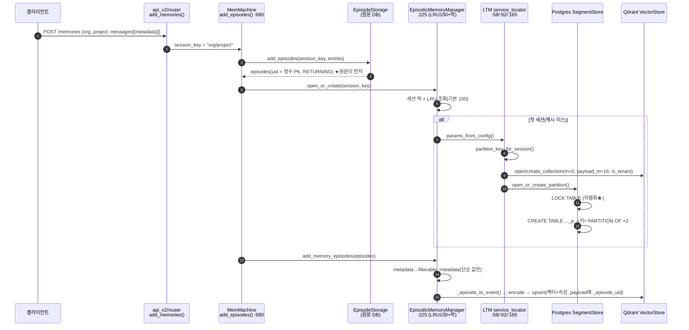
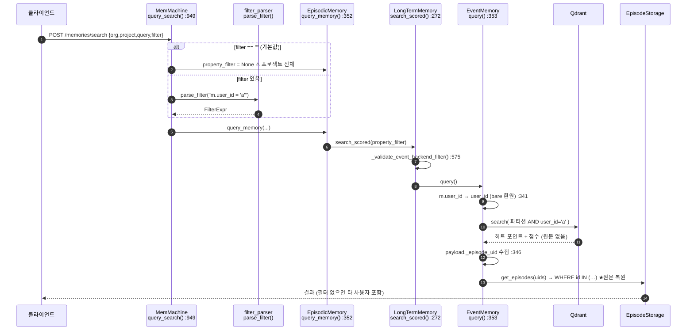
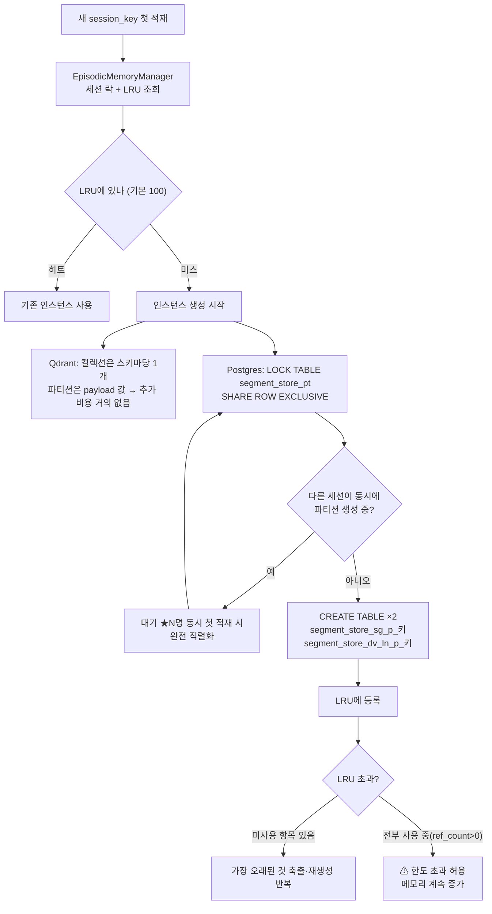
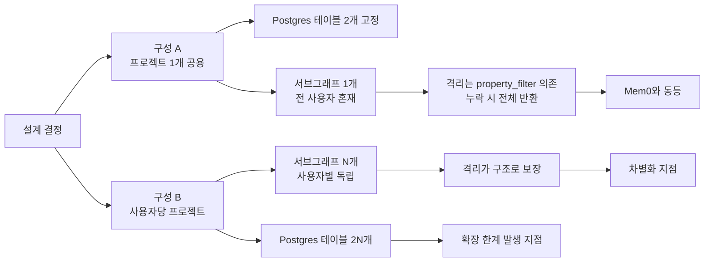
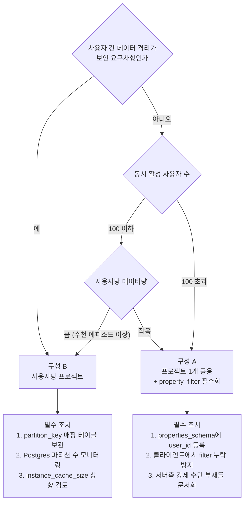
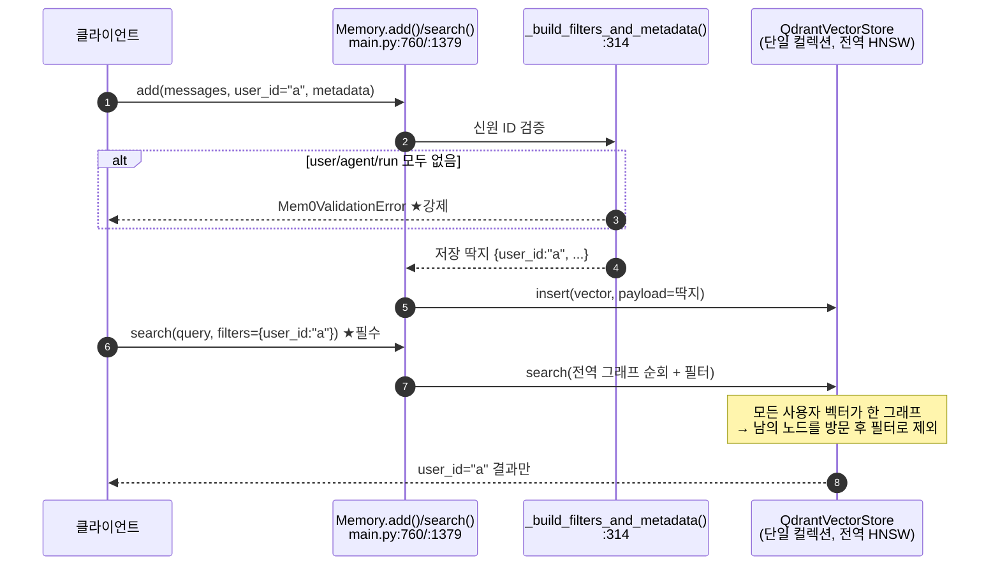
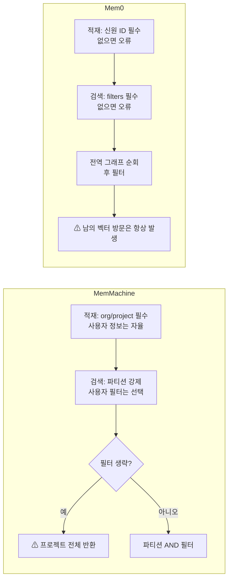
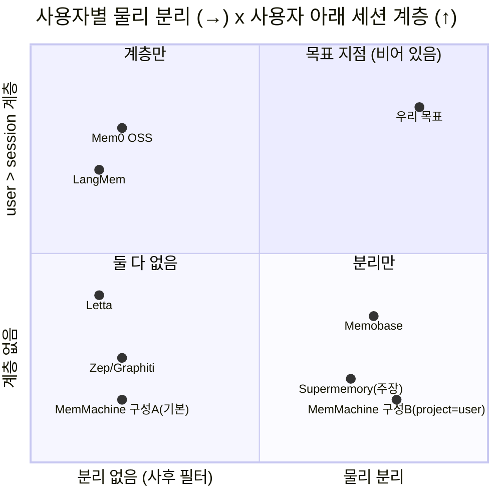

# 다중 사용자 LTM 구조 — 최종 정리 (직접 검증 가이드 포함)

*2026-08-21 · 오태진*
*기준: MemMachine `upstream/main` `2d28c1c` (무수정) · Mem0 OSS `main` · Supermemory 공식 문서*
*이 문서의 모든 주장에는 §번호로 연결되는 **직접 확인 명령**이 있습니다.*
*수록된 mermaid 다이어그램 9종은 `@mermaid-js/mermaid-cli` 11.16.0 으로 파싱 검증을 마쳤습니다.*

---

## 목차

| 장 | 내용 |
|---|---|
| 0 | 결론 요약 |
| 1 | 개념 — 사용자 분리의 4방식 |
| 2 | **MemMachine** (주 대상): 스코프 모델 · 적재/검색 call path · 다이어그램 |
| 3 | MemMachine 직접 검증 — 명령어 순서대로 |
| 3.5 | **프로젝트 구성 설계** — 사용자당 프로젝트 생성 기준 |
| 4 | Mem0: call path · 다이어그램 · 검증 |
| 5 | Supermemory: 조사 결과 · 검증 한계 |
| 6 | 3사 종합 비교와 포지셔닝 |
| 7 | 우리 차별화 결론 |
| 부록 | 검증 자산 위치 · 근거 문서 목록 |

---

# 0. 결론 요약

| # | 결론 | 검증 방법 |
|---|---|---|
| 1 | MemMachine의 격리 단위는 `org_id/project_id` 문자열 하나. **사용자·세션 계층 없음** | §3-V1 |
| 2 | 벡터층(Qdrant)은 **파티션(=`org/project`)별 독립 HNSW 서브그래프** (전역 그래프 없음) — 벤더 권장 방식. **단 파티션 ≠ 사용자** | §3-V2, §1 |
| 3 | 관계형층(Postgres)은 **파티션마다 실제 테이블 2개 생성 + 생성 직렬화** — 유일한 안티패턴 | §3-V3, V8 |
| 4 | event 백엔드에서 `m.user_id` **메타데이터 필터 정상 동작** (유출 0건 실증) | §3-V5 |
| 5 | 단, 필터는 **선택 사항** — 생략하면 프로젝트 전체 검색. 색인은 `properties_schema` 등록 시에만 | §3-V4, V6 |
| 6 | Mem0 OSS는 **단일 컬렉션 + 사후 필터**. 물리 분리 0단계, 대신 신원 ID 지정을 API가 강제 | §4-V1~V3 |
| 7 | **Supermemory는 containerTag마다 전용 벡터 네임스페이스를 주장** — 단 백엔드 비공개로 코드 검증 불가, 태그는 단일·평면(계층 없음) | §5 |
| 8 | **기본 구성(프로젝트에 다수 사용자)에서는 사용자 관점에서 MemMachine도 Mem0와 같은 "전역 인덱스 + 사후 필터"로 동작.** 사용자별 서브그래프는 `project_id = user` 로 구성할 때만 성립 | §1, §3.5 |
| 9 | 그 구성으로 가면 격리를 얻는 대신 **Postgres 테이블 2N개 + 캐시 슬롯 N개** 발생 — 이득과 대가가 같은 결정에서 나옴 | §3.5 |
| 10 | **"사용자별 물리 분리 + 사용자 아래 세션 계층"을 코드로 확인 가능한 오픈소스는 없음** → 우리 차별화 자리 | §6 |

---

# 1. 개념 — 사용자 분리의 4방식

모든 솔루션은 이 넷 중 하나로 분류된다. (상세 배경: `ltm_multiuser_report.md` §2~3)

### 먼저 — 이 논의의 범위

**DB 인스턴스(서버)를 사용자마다 띄우는 이야기는 아니다.** 그건 어떤 솔루션도
하지 않고 검토 대상도 아니다. 아래 4방식은 **하나의 DB 인스턴스 안에서**
사용자를 어떻게 나누느냐의 문제다.

```
DB 인스턴스 (Qdrant 1대 / Postgres 1대)      ← 이 층은 항상 공용. 논의 대상 아님
└── 컬렉션 · 테이블                           ← ①은 여기를 사용자마다 만든다
     └── 파티션 · 샤드 · 인덱스 구조           ← ②는 여기를 사용자마다 만든다
          └── 행/포인트의 속성 값              ← ③·④는 여기서 구분한다
```

### 4방식

| 방식 | 사용자마다 무엇이 새로 생기나 | 남의 벡터를 방문하나 | 확장성 |
|---|---|---|---|
| **① 물리 객체 생성** | **DDL 객체 1개 이상**<br/>Qdrant: 컬렉션 / Postgres: 테이블·파티션 | 안 함 | ❌ **벤더가 금지**<br/>Qdrant 클라우드 컬렉션 1,000개 상한 |
| **② 파티션 서브그래프** | 인덱스 내부의 **독립 링크 구조**<br/>(컬렉션·테이블은 그대로 1개) | 안 함 | ✅ |
| **③ 키 선행 정렬** | 아무것도 안 생김<br/>(공유 테이블 + `user_id` 선행 인덱스) | 안 함 | ✅ (사용자당 데이터 적을 때) |
| **④ 전역 인덱스 + 사후 필터** | 아무것도 안 생김<br/>(속성 값으로만 구분) | **함** | ⚠ 사용자 늘수록 악화 |

**①과 ②의 차이가 핵심이다.** 둘 다 "사용자별 인덱스 분리"라고 부를 수 있지만:

| | ① | ② |
|---|---|---|
| Qdrant에서 | `create_collection()` 을 사용자마다 호출 | 컬렉션은 1개, `payload_m` 으로 **파티션별 HNSW 링크**만 분리 |
| Postgres에서 | `CREATE TABLE ... PARTITION OF` 를 사용자마다 실행 | (해당 없음 — 관계형에는 ②에 대응하는 개념이 없음) |
| 사용자당 고정비 | 카탈로그·메타데이터·파일 핸들 | 사실상 없음 |
| 1,000명일 때 | 컬렉션/테이블 1,000개 | 컬렉션 1개, 서브그래프 1,000개 |

> 목표는 "①을 하자"가 아니라 **"④를 피하자"**다. ②·③이면 목적은 달성되고,
> ①은 벤더가 명시적으로 말리는 방식이다.

### ⚠ 분류할 때 반드시 층위를 맞출 것

위 4방식은 **"사용자마다"** 무엇이 생기는지로 정의했다. 그런데 MemMachine의
격리 단위는 사용자가 아니라 **`session_key`(= `org_id/project_id`)** 다.
따라서 **"MemMachine = ②"라고 단정할 수 없다.** 파티션을 무엇에 매핑하느냐에 따라
사용자 관점 분류가 달라진다.

| | 파티션 경계에서의 구현 | **사용자 관점 — 구성 A**<br/>(프로젝트 1개에 다수 사용자) | **사용자 관점 — 구성 B**<br/>(`project_id = user_123`) |
|---|---|---|---|
| **MemMachine 벡터층** | ② 파티션 서브그래프 | **④** — 한 서브그래프에 전 사용자 혼재, 사후 필터 | **②** — 사용자별 독립 서브그래프 |
| **MemMachine 관계형층** | ① 테이블 생성 | ① (테이블 2개 고정) | ① (테이블 **2N개**) ⚠ |
| **Mem0 OSS** | 파티션 개념 없음 | **④** | **구성 불가** |

**정확한 진술**
- ❌ "MemMachine은 ②, Mem0는 ④다"
- ✅ **"MemMachine은 ②를 선택할 수 있고, Mem0는 ④밖에 없다"**

즉 MemMachine의 ②는 **고정된 속성이 아니라 구성 선택지**이며,
**기본적인 사용 형태(구성 A)에서는 사용자 관점에서 ④로 동작한다.**
그리고 ②를 선택하는 순간 관계형층에 사용자당 테이블 2개가 발생한다(§3.5).

분류 결과 미리보기 (파티션 경계 기준):
**MemMachine 벡터층=② / 관계형층=①(문제)** · **Mem0=④** ·
**Supermemory=②에 가까운 주장(검증 불가)** · Memobase=③ · Zep/Letta=④

※ MemMachine이 "①과 ②를 동시에" 쓰는 것처럼 보이는 이유: 같은 `partition_key`가
벡터DB에서는 payload 값(②)으로, Postgres에서는 실제 테이블(①)로 구현되기 때문이다.
같은 논리 구획을 두 저장소가 다른 방식으로 실현한다.

---

# 2. MemMachine — 구조와 call path

## 2.1 스코프 모델

```
org_id ─┐
        ├─→ session_key = "org_id/project_id"   ← 유일한 격리 키
project_id ─┘         │
                      ├─→ partition_key  (32자 이하면 그대로, 아니면 sha256 앞 32자)
                      │      ├─ 벡터DB: payload 값 + 독립 HNSW 서브그래프
                      │      └─ Postgres: 실제 테이블 파티션 2개
                      │
   producer_id, m.user_id 등 ──→ 격리 키 아님. 검색 조건용 속성 (선택)
```

## 2.2 적재(add) call path — 함수를 이 순서로 쫓아가면 된다

경로 접두사: `packages/server/src/memmachine_server/`

```
① server/api_v2/router.py:285            @router.post("/memories") add_memories()
② server/api_v2/service.py:53~           _add_messages_to()
     - messages[] → EpisodeEntry[] 변환
     - _SessionData(:39).session_key(:44) = f"{org_id}/{project_id}"
③ main/memmachine.py:680                 MemMachine.add_episodes()
     :700  episode_storage.add_episodes(session_key, entries)   ★ 원문 저장 + uid 발급
           episode_sqlalchemy_store.py:212  INSERT … RETURNING → id(자동증가 정수 PK)
           ※ 원문 테이블 episodestore 는 파티션 없음 — 격리는 session_key 평문 컬럼
     :712  episodic_memory_manager.open_or_create_episodic_memory(session_key)
④ episodic_memory/episodic_memory_manager.py:225   open_or_create_episodic_memory()
     :89   세션별 RW 락  /  :82,141~175  인스턴스 LRU (기본 100, :43)
⑤ episodic_memory/service_locator.py:19            episodic_memory_params_from_config()
⑥ episodic_memory/long_term_memory/service_locator.py:58
                                          long_term_memory_params_from_config()
     :92   _event_params()  (backend: event 일 때)
     :165  partition_key_for_session()               ← 세션→파티션 키
     :113~ vector_store.open/create_collection       ← 벡터 컬렉션 (스키마 해시당 1개)
     :140  segment_store.open_or_create_partition    ← Postgres 파티션
⑦ common/vector_store/qdrant_vector_store.py:735    _create_native_collection()
     :752  m=0                ← 전역 HNSW 끔
     :753  payload_m=16       ← 파티션별 서브그래프
     :764  is_tenant=True     ← 테넌트 디스크 co-location
⑧ event_memory/segment_store/sqlalchemy_segment_store.py:853  open_or_create_partition()
     :801  LOCK TABLE ... SHARE ROW EXCLUSIVE        ← 파티션 생성 직렬화 ★
     :1045 _create_pg_child_tables()                 ← CREATE TABLE ... PARTITION OF ×2 ★
─── 여기까지가 세션 준비. 이후 실제 인덱싱 ───
⑨ episodic_memory/episodic_memory.py:208  add_memory_episodes()
     :221~228  metadata 중 단순 값만 → filterable_metadata 복사
⑩ episodic_memory/long_term_memory/long_term_memory.py:233  add_episodes()
     :243  _episode_to_event()  (:632)
             시스템 필드 → "_producer_id" 등 "_" 접두사
             사용자 metadata → bare 키 그대로 (properties.update)
             "_" 시작 사용자 키는 ValueError (시스템 필드 사칭 방지)
⑪ event_memory/event_memory.py            encode_events() → VectorStore 저장
```

### 시퀀스 다이어그램 (적재)



## 2.3 검색(search) call path

```
① server/api_v2/router.py:299            @router.post("/memories/search") search_memories()
② main/memmachine.py:949                 MemMachine.query_search()
     :984  property_filter = parse_filter(search_filter) if search_filter else None
           ← filter 기본값 "" → None → 필터 없음(프로젝트 전체)
③ episodic_memory/episodic_memory.py:352 query_memory(property_filter=...)
     :331  _query_long_term_memory()   (STM은 :314; BOTH 모드 :82)
④ episodic_memory/long_term_memory/long_term_memory.py:272  search_scored()
     :318  _validate_event_backend_filter()  (:575)
             bare 이름 → 시스템 필드 목록 대조
             m.<키>    → user_property_keys 대조 (비어 있으면 통과)
⑤ event_memory/event_memory.py:353       query()
     :417  map_filter_fields(filter, _to_vector_record_property)
     :341  _to_vector_record_property():
             "producer_id" → "_producer_id"   (시스템)
             "m.user_id"  → "user_id"        (bare 환원)  ← 저장 규칙과 일치
⑥ common/vector_store/qdrant_vector_store.py:336~374  search()
     Filter(must=[ 파티션 조건 , 사용자 필터 ])          ← AND 결합
⑦ long_term_memory.py:346                payload._episode_uid 수집 (점수 순·중복 제거)
⑧ long_term_memory.py:357                episode_storage.get_episodes(uids)
                                          → int 캐스팅 후 WHERE id IN (…) PK 조회
                                          ← uid → 원문 복원  ★②경로가 없었으면 여기서 실패
```

### 시퀀스 다이어그램 (검색)



## 2.4 필터 처리 순서도

```mermaid
flowchart TD
    A["search 요청<br/>filter: str"] --> B{"filter == 빈 문자열?"}
    B -->|"예 (기본값)"| C["property_filter = None"]
    C --> D["파티션 전체가 검색 대상<br/>프로젝트 내 모든 사용자 포함"]
    B -->|아니오| E["parse_filter → FilterExpr"]
    E --> F{"필드 표기 형식"}
    F -->|"bare 이름<br/>producer_id 등"| G{"시스템 필드 목록에<br/>존재하는가"}
    G -->|아니오| H["ValueError<br/>Unknown filter field"]
    G -->|예| I["언더스코어 접두사 부착<br/>producer_id → _producer_id"]
    F -->|"m.키 또는<br/>metadata.키"| J{"properties_schema<br/>등록 상태"}
    J -->|미등록| K["검증 생략, 통과<br/>payload 인덱스 없음 → 전수 스캔"]
    J -->|"등록됨, 키 일치"| L["통과<br/>payload 인덱스 사용"]
    J -->|"등록됨, 키 불일치"| M["ValueError<br/>Unknown user-metadata filter field"]
    K --> N["bare 키로 환원<br/>m.user_id → user_id"]
    L --> N
    I --> O["벡터 검색<br/>partition_key 조건 AND property_filter"]
    N --> O
    O --> P["payload _episode_uid 수집 →<br/>episode_storage WHERE id IN (…)<br/>원문 복원 (파티션 무관)"]
```



## 2.5 세션 첫 적재 순서도 (파티션 생성 비용)



---

# 3. MemMachine 직접 검증 — 순서대로 실행

전 단계 공통:
```bash
cd /Users/taejin/Projects/MemMachine/repo
SRV=packages/server/src/memmachine_server
```

### V0. 기준 코드가 무수정 upstream인지

```bash
git log --oneline -1 upstream/main          # → 2d28c1c ...
git diff --stat 2d28c1c -- packages/        # → 출력 없음 = 서버 코드 무수정
git status --short | grep -v '^??'          # → evaluation/utils/agent_utils.py 만 (평가 하네스)
```

### V1. 격리 키 = org/project 문자열 하나 (사용자·세션 계층 없음)

```bash
sed -n 39,46p $SRV/server/api_v2/service.py
# 기대: session_key = f"{self.org_id}/{self.project_id}"
grep -rn "user_id" $SRV/server/api_v2/router.py | head -3
# 기대: (출력 없음) — 라우터 어디에도 user_id 라는 1급 파라미터가 없음
```

### V2. 벡터층 = 방식 ② 파티션 서브그래프 (컬렉션은 1개, 전역 HNSW 없음)

```bash
sed -n 749,766p $SRV/common/vector_store/qdrant_vector_store.py
# 기대: m=0 / payload_m=self._hnsw_m(=16) / is_tenant=True
grep -n "_build_native_collection_name" -A 4 $SRV/common/vector_store/qdrant_vector_store.py | head -8
# 기대: 컬렉션명 = f"{namespace}__{스키마해시}" — 사용자 수와 무관하게 1개
```

### V3. 관계형층 = 방식 ① 물리 객체 생성 (파티션마다 실제 테이블 2개)

```bash
grep -n "postgresql_partition_by" $SRV/episodic_memory/event_memory/segment_store/sqlalchemy_segment_store.py
# 기대: LIST (partition_key) 가 2곳 (:166, :194)
sed -n 1045,1062p $SRV/episodic_memory/event_memory/segment_store/sqlalchemy_segment_store.py
# 기대: CREATE TABLE ..._p_<키> PARTITION OF ... ×2
sed -n 799,804p $SRV/episodic_memory/event_memory/segment_store/sqlalchemy_segment_store.py
# 기대: LOCK TABLE segment_store_pt IN SHARE ROW EXCLUSIVE MODE  (자기충돌 잠금 = 직렬화)
```

### V4. 검색 필터는 선택 사항 (기본값 빈 문자열)

```bash
grep -n 'default=""' -B 3 packages/common/src/memmachine_common/api/spec.py | head -8
# 기대: SearchMemoriesSpec 내 filter 필드
grep -n "parse_filter(search_filter) if search_filter else None" $SRV/main/memmachine.py
# 기대: 1건 — 빈 문자열이면 필터 자체가 None
```

### V5. ★ event 백엔드에서 m.user_id 필터가 실제로 동작 (동적 실증)

```bash
rm -f /tmp/smoke_seg.db /tmp/smoke_vectors.db
.venv/bin/python docs/msr/verify/test_event_filter_upstream.py
```
기대 출력:
```
① 필터 없음                  : 8건 (user_a 4 / user_b 4)
② m.user_id='user_a'        : 4건, 유출 0건  ✅
③ metadata.user_id='user_b' : 4건, 유출 0건  ✅
④ producer_id='user_a'      : 4건, 유출 0건  ✅
PASS — upstream 코드만으로 event 백엔드 필터 동작 확인
```
이 스크립트는 `evaluation/*`(우리 수정본)를 import 하지 않고 `memmachine_server`
패키지만 사용하며, 서버와 동일한 적재 순서(원문 저장→인덱싱)를 직접 재현한다.
소스: `docs/msr/verify/test_event_filter_upstream.py` (설정: 같은 폴더 `smoke_event.yml`)

### V6. 저장/검색 이름 규칙의 왕복 일치 (왜 동작하는지)

```bash
sed -n 632,660p $SRV/episodic_memory/long_term_memory/long_term_memory.py
# 기대: 시스템 필드 "_" 접두사 / filterable_metadata 는 bare 로 properties.update
sed -n 341,352p $SRV/episodic_memory/event_memory/event_memory.py
# 기대: 검색 시 "m.foo" → "foo"(bare 환원), bare 시스템 필드 → "_foo"
sed -n 575,612p $SRV/episodic_memory/long_term_memory/long_term_memory.py
# 기대: properties_schema 가 비어 있으면(user_property_keys 빈 set) m.* 검증 생략
```

### V7. 앱 계층 — LRU 100 / 동시 사용 시 한도 미보장

```bash
sed -n 42,52p $SRV/episodic_memory/episodic_memory_manager.py
# 기대: instance_cache_size 기본 100 / max_life_time 600
sed -n 170,185p $SRV/episodic_memory/instance_lru_cache.py
# 기대: ref_count > 0 이면 축출 건너뜀 → 제거할 것 없으면 한도 넘겨 추가
```

### V8. (선택·서버 실물) Postgres 파티션과 Qdrant 컬렉션 수

docker 로 Postgres + Qdrant 를 띄우고 event 백엔드 설정으로 `memmachine-server`
기동 후, 프로젝트를 N개 만들어 적재하고:

```bash
# Qdrant — 사용자를 늘려도 컬렉션 개수가 안 늘어나는지 (방식 ② 확인)
curl -s localhost:6333/collections | jq '.result.collections[].name'
# 기대: long_term_memory__<해시> (+registry) — 개수 불변

# Postgres — 사용자마다 테이블(파티션)이 2개씩 늘어나는지 (방식 ① 확인)
psql -c "SELECT count(*) FROM pg_class WHERE relispartition;"
psql -c "\d+ segment_store_sg"      # Partition key: LIST (partition_key) + 자식 목록
psql -c "SELECT relname FROM pg_class WHERE relname LIKE 'segment_store_sg_p_%' LIMIT 5;"
```

### V9. (선택) 서버 REST 로 필터 확인

```bash
curl -X POST localhost:8080/api/v2/memories/search -H 'Content-Type: application/json' -d '{
  "org_id":"org1","project_id":"prj1",
  "query":"what food do I like",
  "filter":"m.user_id = '\''user_a'\''"}'
# filter 를 빼고 다시 호출 → 두 사용자 결과가 섞여 나오는 것과 대조
```

---

# 3.5 프로젝트 구성 설계 — 사용자당 프로젝트를 만들 것인가

## 3.5.1 두 구성의 대칭 구조

**이득과 대가가 같은 결정에서 나온다.** 한쪽만 취할 수 없다.

| | **구성 A — 프로젝트 1개 공용**<br/>`project_id = "prod"`, 사용자는 metadata | **구성 B — 사용자당 프로젝트**<br/>`project_id = "user_123"` |
|---|---|---|
| `session_key` 개수 | 1 | N (사용자 수) |
| `partition_key` 개수 | 1 | N |
| HNSW 서브그래프 | **1개** — 전 사용자 벡터가 한 그래프 | **N개** — 사용자마다 독립 |
| 검색 시 방문 범위 | 전 사용자 벡터를 순회 후 `property_filter` 로 제외 | 해당 사용자 서브그래프만 순회 |
| Qdrant 컬렉션 | 1 | **1** (동일 — 스키마 해시 기준이므로 사용자 수 무관) |
| **Postgres 자식 테이블** | **2개 (총합)** | **2N개** ⚠ |
| 앱 인스턴스 캐시 슬롯 | 1 | 활성 사용자 수만큼 (기본 한도 100) |
| 파티션 생성 DDL | 최초 1회 | 신규 사용자마다 (SHARE ROW EXCLUSIVE 직렬화) |
| 사용자 격리 보장 주체 | **호출자** (필터 누락 시 전체 반환) | **구조** (파티션 지정이 검색의 전제) |
| Mem0 대비 | **기능적으로 동등** | Mem0로 재현 불가 |

> **구성 A는 Mem0와 동등하다** — 사용자당 고정비가 없는 대신 사용자 격리도 없다.
> **구성 B는 사용자 격리를 얻는 대신 사용자당 Postgres 테이블 2개와 캐시 슬롯을 소비한다.**
> 본 과제의 기술 목표는 **B의 격리를 A의 비용으로** 얻는 것이다.



## 3.5.2 사용자당 프로젝트 생성 시 지켜야 할 기준

구성 B를 택할 경우 **코드에서 강제되는 제약**과 **운영상 판단 기준**이다.

### (1) 코드가 강제하는 제약

| 항목 | 규칙 | 근거 |
|---|---|---|
| `partition_key` 형식 | `[a-z0-9_]+` 이고 32바이트 이하이면 그대로 사용, 아니면 **sha256 앞 32자로 해시** | `service_locator.py:165` `partition_key_for_session()` |
| **실제 동작** | `session_key = "org/project"` 는 슬래시(`/`)를 포함하므로 **항상 해시된다** | 실측: `org1/prj1` → `baf1a5e6a767ce9f628b16fe0614a887` |
| 벡터스토어 이름 검증 | `[a-z0-9_]+`, 32바이트 이하 (해시 후 값이 통과) | `qdrant_vector_store.py` `validate_identifier()` |
| Postgres 자식 테이블명 | `segment_store_sg_p_<partition_key>` / `segment_store_dv_ln_p_<partition_key>` | `sqlalchemy_segment_store.py:1045` |

⚠ **운영 함의**: 파티션 키가 해시이므로 **Postgres 테이블명만 보고 어느 사용자인지 알 수 없다.**
원본 매핑은 DEBUG 로그에만 남는다(`partition_key_for_session` 의 debug 로그).
사용자당 프로젝트로 운영하려면 **`org/project` ↔ `partition_key` 매핑 테이블을 별도로 보관**해야
장애 대응이 가능하다.

### (2) 규모 판단 기준

| 지표 | 계산 | 임계 근거 |
|---|---|---|
| Postgres 자식 테이블 수 | **2 × 사용자 수** | PostgreSQL 문서: 플래너는 "수천 개까지" 처리 가능하되 정리 후 남는 파티션이 많을수록 계획 시간·메모리 증가 → **사용자 약 500명에서 테이블 1,000개** |
| 세션별 메타데이터 메모리 | 파티션을 건드리는 **모든 DB 세션의 로컬 메모리에 적재** | PostgreSQL 문서 명시. 커넥션 풀 공유 구조에서는 한 연결이 여러 사용자 파티션을 순차로 건드림 |
| 앱 인스턴스 캐시 | 동시 활성 사용자 수 vs `instance_cache_size`(기본 100) | 초과 시 축출·재생성 반복. 단 `ref_count > 0` 이면 축출하지 않고 **한도를 넘겨 추가**하므로 동시 사용 구간에서는 상한이 보장되지 않음 |
| 신규 사용자 적재 지연 | 파티션 생성 DDL이 `SHARE ROW EXCLUSIVE` 로 **전역 직렬화** | 동시 신규 가입 N명이면 순차 대기 |

### (3) 구성 선택 기준



### (4) 어느 구성이든 공통으로 해야 할 것

| # | 조치 | 이유 |
|---|---|---|
| 1 | 설정의 `properties_schema` 에 `user_id: str` 등록 | 미등록이어도 필터는 동작하지만 payload 인덱스가 생성되지 않아 전수 스캔이 된다 (§3-V6) |
| 2 | `properties_schema` 를 프로젝트 간 **동일하게 유지** | 컬렉션 이름이 스키마 해시 기반이므로, 스키마가 다르면 **네이티브 컬렉션이 분리된다** (§3-V2) |
| 3 | 검색 요청에서 `filter` 누락 여부 점검 | 기본값이 빈 문자열이며 서버가 강제하지 않는다 (§3-V4) |

---

# 4. Mem0 (OSS) — call path와 검증

## 4.1 스코프 모델

```
(org/project 개념 없음 — OSS 기준)
user_id / agent_id / run_id  ← 최소 1개 필수 (없으면 Mem0ValidationError)
        │
        └→ 전부 payload 메타데이터. 물리 구획 아님
컬렉션: 설정값 하나 (collection_name) — 사용자 수와 무관
```

## 4.2 call path

```
[적재]
mem0/memory/main.py:760   Memory.add(user_id/agent_id/run_id, metadata)
  :314  _build_filters_and_metadata()
          → base_metadata_template (저장용 딱지)
          → effective_query_filters (검색용 조건)
  :143  _strip_identity_keys()   ← 자유 metadata 로 남의 스코프 침범 방지(#6655)
  → LLM 사실 추출(infer=True) → vector_store.insert(payload=딱지)

[검색]
mem0/memory/main.py:1379  Memory.search(query, filters)   ← filters 필수
  :314  _build_filters_and_metadata() 재사용
  → vector_store.search(query_vector, filters)
      mem0/vector_stores/qdrant.py:128  create_col()   ← hnsw_config 지정 없음 = 전역 그래프
      :166  _create_filter_indexes()    ← user_id 등 4종 keyword 인덱스
                                          단, 로컬(is_local)이면 건너뜀
  → 전역 ANN 결과에서 필터로 걸러냄
```

### 시퀀스 다이어그램



### 순서도 — 두 시스템의 강제 지점 차이



## 4.3 직접 검증

```bash
mkdir -p ~/ltm-survey && cd ~/ltm-survey
curl -sSL https://raw.githubusercontent.com/mem0ai/mem0/main/mem0/memory/main.py -o mem0_main.py
curl -sSL https://raw.githubusercontent.com/mem0ai/mem0/main/mem0/vector_stores/qdrant.py -o mem0_qdrant.py

# V1. 컬렉션이 설정값 하나 (사용자별로 안 늘어남)
grep -n "self.collection_name = " mem0_main.py            # → :501, :2180
# V2. 신원 ID 필수 강제
grep -n "At least one of" mem0_main.py                    # → Mem0ValidationError
# V3. org/project 개념 없음
grep -c "org_id\|project_id" mem0_main.py                 # → 0
# V4. 전역 HNSW (파티션 서브그래프 설정 없음)
sed -n 128,160p mem0_qdrant.py                            # → hnsw_config 지정 없음
# V5. 필터 인덱스 4종 — 단 로컬은 건너뜀
sed -n 166,186p mem0_qdrant.py                            # → is_local이면 skip
```

---

# 5. Supermemory — 조사 결과

## 5.1 공식 문서가 주장하는 구조

**containerTag** 하나로 스코프를 지정하는 모델이다.

| 항목 | 내용 |
|---|---|
| 스코프 단위 | `containerTag` 문자열 1개 (예: `"user_alex"`) |
| **물리 구조 (주장)** | *"각 컨테이너 태그는 **전용 벡터 네임스페이스로 해시**된다. 한 태그의 임베딩·청크·메모리 항목은 다른 모든 태그와 **독립적으로 저장·검색**된다. 걸러낼 공유 인덱스가 없다"* — 방식 ①/② 계열의 **물리 분리 주장** (어느 쪽인지는 비공개라 판별 불가) |
| 자동 생성 | 새 태그로 첫 쓰기 시 컨테이너 자동 생성 |
| **권한 연동** | API 키를 특정 태그 집합으로 제한 가능(태그별 읽기/쓰기 권한). 범위 밖 태그 요청은 403 — **조사 대상 중 유일하게 격리가 인가와 연결됨** |
| 태그 개수 | 메모리당 **1개** (복수형 `containerTags`는 폐기됨) |
| **계층** | **없음.** `org:acme:user:john` 처럼 문자열 안에 계층을 흉내낼 수 있으나 시스템은 의미를 해석하지 않는 평면 식별자 |

## 5.2 검증 한계 — 반드시 알아야 할 것

| 항목 | 상태 |
|---|---|
| 백엔드 소스 | **비공개.** 공개 리포(supermemoryai/supermemory)는 프론트엔드+SDK 위주 |
| 셀프호스팅 | 엔터프라이즈 전용 (Cloudflare Workers + Postgres/pgvector 구성이라고 안내) |
| "전용 네임스페이스"의 실제 구현 | **코드로 확인 불가** — pgvector 위에서 태그별로 무엇이 만들어지는지(테이블? 파티션? 인덱스? 단순 키 선행?) 알 수 없음 |
| 사용자당 고정비 | 알 수 없음 (10,000+ 사용자 운영 사례를 홍보하나 비용 구조 비공개) |

> **평가**: 주장대로라면 "사용자별 물리 분리"를 상용으로 구현한 유일한 사례.
> 그러나 ① 코드 검증 불가 ② 태그가 단일·평면이라 **사용자>세션 계층은 없음**
> ③ 우리가 통제할 수 없는 폐쇄형 백엔드. — 방향의 시장성을 방증하는 근거로는
> 유용하지만, 우리 요구(R1+R2)를 채우지는 못한다.

## 5.3 확인 방법 (문서 수준)

```bash
# 공개 리포에 백엔드가 없는지 훑기
curl -s "https://api.github.com/repos/supermemoryai/supermemory/git/trees/main?recursive=1" \
  | python3 -c "import json,sys; [print(x['path']) for x in json.load(sys.stdin)['tree'][:80]]"
# 문서
open https://supermemory.ai/docs/concepts/container-tags
```

---

# 6. 3사 종합 비교

| | **MemMachine** | **Mem0 OSS** | **Supermemory** |
|---|---|---|---|
| 격리 단위 | `org/project` (문자열 1개) | 없음 (딱지뿐) | `containerTag` (문자열 1개) |
| 파티션 경계 구현 | 벡터 **②** 서브그래프 / 관계형 **①** 테이블 생성⚠ | 파티션 개념 없음 | **①/②** 주장 (검증 불가) |
| **사용자 관점 (기본 구성)** | **④** — 프로젝트 내 전 사용자 혼재 후 필터 | **④** | ② (태그=사용자로 쓸 때) |
| **사용자 관점 (사용자당 프로젝트)** | **②** — 사용자별 서브그래프 | **구성 불가** | ② |
| 사용자 개념 | 없음 (속성) | **1급** (`user_id`) | 태그로 표현 |
| 사용자>세션 계층 | 없음 | **있음** (`run_id`) | 없음 (평면 태그) |
| 저장 시 신원 강제 | 프로젝트만 | **신원 ID 필수** | 태그 1개 |
| 검색 시 강제 | 파티션만 (필터는 선택⚠) | **filters 필수** | 태그 (+ API 키 권한 403) |
| 인가 연동 | 없음 | 없음 | **있음** (태그별 키 권한) |
| 사용자당 고정비 | Postgres 테이블 2 + 캐시 슬롯 | 0 | 비공개 |
| 코드 검증 | 🟢 완전 | 🟢 완전 | 🔴 불가 |

### 포지셔닝 맵



---

# 7. 결론 — 우리 차별화

1. **오른쪽 위(물리 분리 + 사용자>세션 계층)는 여전히 비어 있다.**
   Supermemory가 오른쪽 아래까지 왔지만 — 폐쇄형이고, 계층이 없고, 검증이 불가하다.
   오히려 **"사용자별 물리 분리"가 상용 셀링포인트가 된다는 방증**이다.
2. **MemMachine이 기본 상태로 오른쪽에 있는 것이 아니다.** 기본 구성에서는 사용자 관점에서
   Mem0와 같은 ④로 동작한다. 오른쪽으로 이동하려면 `project_id = user` 를 택해야 하고,
   그 순간 관계형층 비용이 발생한다. 오른쪽 위로 가는 길은 명확하다:
   - 벡터층: **그대로** (파티션 서브그래프 = 이미 방식 ②, 컬렉션은 1개 유지)
   - 사용자>세션 계층: **신설** (Mem0의 `user/agent/run` 모델 참조)
   - 관계형층: 사용자당 테이블 2개 + 생성 직렬화 **제거** (파티션 단위 상향 또는 방식 교체)
3. 비용 문제는 이미 정량화 대상으로 좁혀졌다 — Postgres 파티션 수 스윕(V8)과
   앱 캐시 동작(V7)이 평가 1주차 실측 항목이다.

---

# 부록

## A. 검증 자산

| 파일 | 용도 |
|---|---|
| `docs/msr/verify/test_event_filter_upstream.py` | §3-V5 동적 실증 (upstream 코드만 사용) |
| `docs/msr/verify/smoke_event.yml` | 위 스크립트용 설정 (외부 서비스·API 키 불필요) |

## B. 출처

**소스 코드 (직접 확인)**
- MemMachine: 로컬 체크아웃 `upstream/main` `2d28c1c` — [github.com/MemMachine/MemMachine](https://github.com/MemMachine/MemMachine)
- Mem0 OSS: [github.com/mem0ai/mem0](https://github.com/mem0ai/mem0) — `mem0/memory/main.py`, `mem0/vector_stores/qdrant.py`

**공식 문서**
- [Supermemory — Container Tags](https://supermemory.ai/docs/concepts/container-tags)
- [Supermemory — Self-hosted vs Cloud](https://supermemory.ai/blog/self-hosted-ai-memory-tradeoffs/)
- [Mem0 — Organizations & Projects (유료 서비스)](https://docs.mem0.ai/api-reference/organizations-projects)
- [Qdrant — Multitenancy](https://qdrant.tech/documentation/manage-data/multitenancy/) · [Custom Sharding](https://qdrant.tech/articles/multitenancy/)
- [Milvus — Multi-tenancy](https://milvus.io/docs/multi_tenancy.md)
- [PostgreSQL — Table Partitioning](https://www.postgresql.org/docs/current/ddl-partitioning.html) · [Explicit Locking](https://www.postgresql.org/docs/current/explicit-locking.html)

**이 문서가 종합한 개별 문서**
`ltm_multiuser_synthesis.md`(임원용 종합) · `ltm_multiuser_report.md`(구조 비교) ·
`memmachine_vs_mem0_scoping.md`(스코핑 상세) · `event_backend_filter_verification.md`(필터 실증) ·
`memmachine_multiuser_architecture.md` · `open_ltm_multiuser_survey.md`
