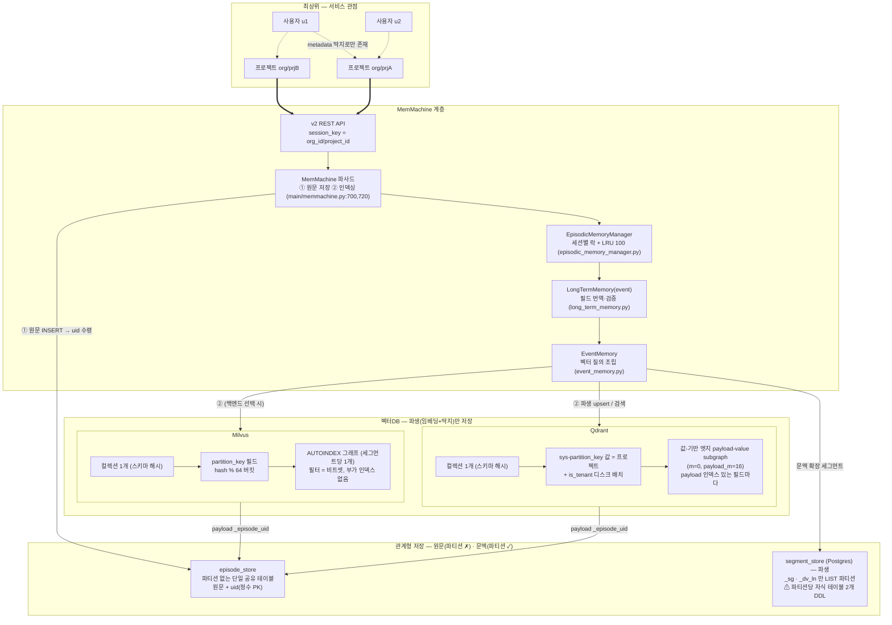
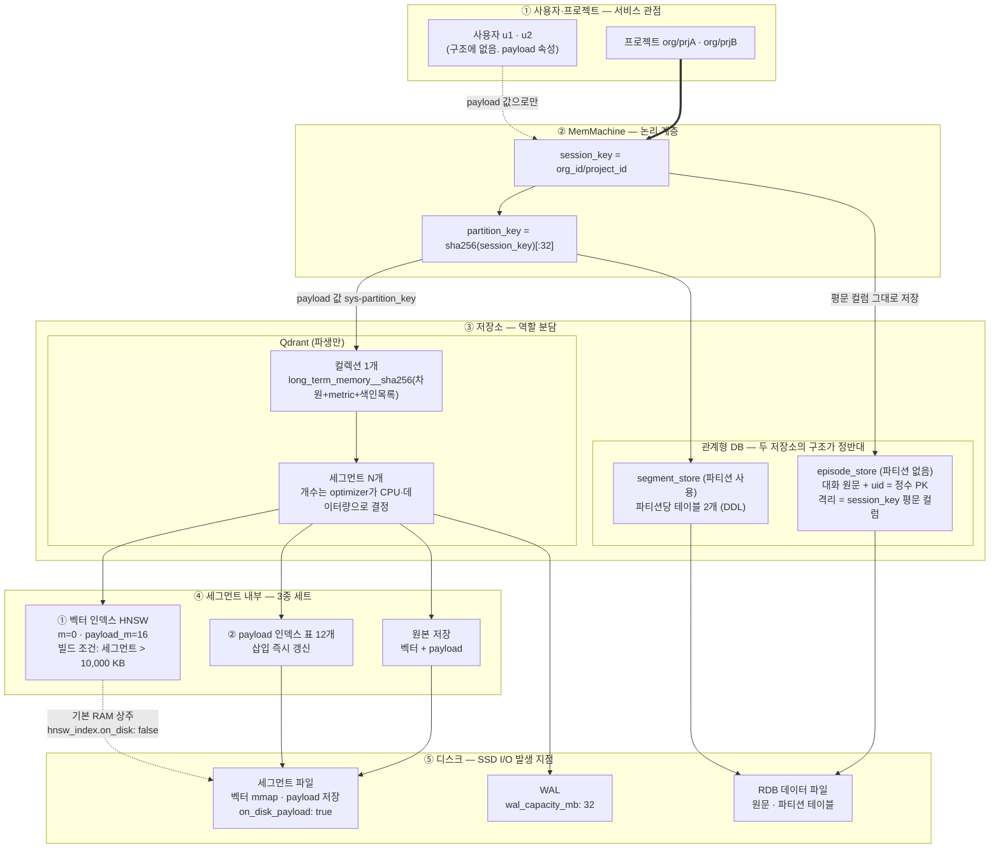
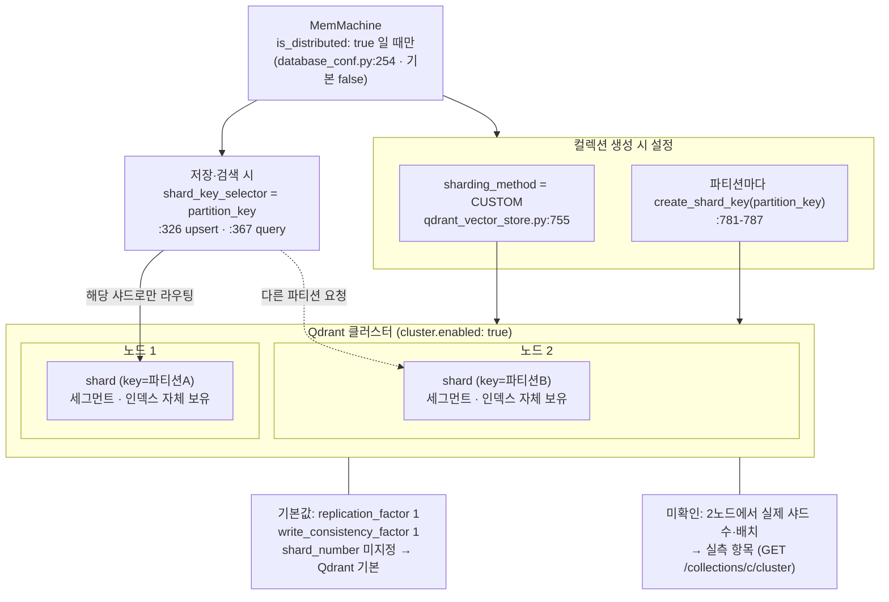
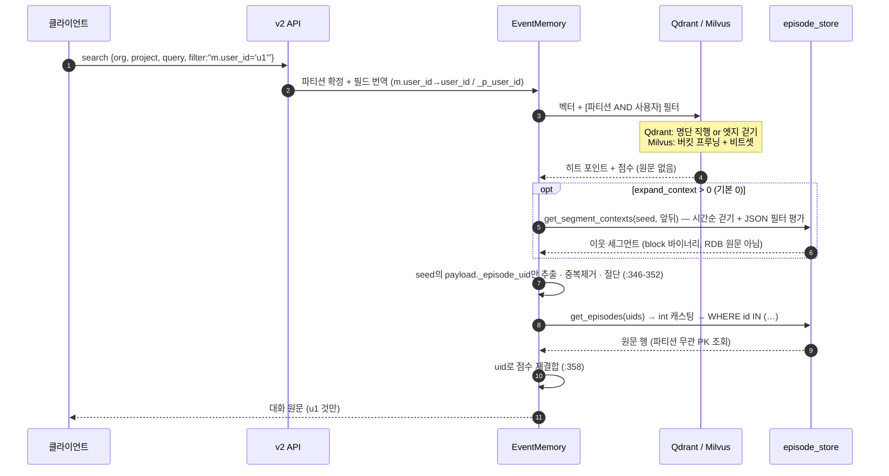

# MemMachine × 벡터DB(Qdrant·Milvus) 구조 — 최종 정리본 v9

*2026-08-27 · 기준 `upstream/main` `2d28c1c` (무수정) · 파일:줄번호 실측*
*경로 접두사: `packages/server/src/memmachine_server/`*
*용어는 Qdrant/Milvus 공식 표현 기준*
*v7: 앱 캐시(LRU) 실체 규명 — 캐시 대상·ref_count 의미·thrash 조건 정정. 실측 항목 번호 중복 수정*
*v8: uid 정체 규명(자동증가 정수 PK·`INSERT … RETURNING`) · 원문 복원 경로 상세 · **4.2 그림 오류 수정**(`partition_key→episode_store`는 사실과 다름 — 원문 테이블은 파티션 없이 `session_key` 평문 컬럼 사용) · 5.5 원문 테이블 절 신설 · 실측 #10·#11 추가*
*v8.1: 관계형 DB 테이블 4종 분해표 추가 — "원문은 파티션 ✗ / 세그먼트만 파티션 ✓"가 서로 다른 테이블 이야기임을 명시. 비유 표현("원문의 집") 제거*
*v9: **포인트 ID 서술 오류 정정** — 벡터 포인트 ID는 `uuid5(episode.uid)`가 아니라 derivative의 `uuid4()`(랜덤). uuid5는 Event의 uuid. 에피소드→Event→세그먼트→derivative 4단 변환과 개수 관계(1:1 아님) 추가 · 세 저장소의 용도 명시(`_dv_ln`은 삭제용 장부) · **§3.6 문맥 확장 신설** — 사용자 필터는 정확하나 `properties`에 인덱스가 없어 시간순 걷기 발생, 비용은 대상 발화 밀도에 좌우 · §5.6 방어되지 않는 구간 + 개선안 A/B/C · 실측 #12~#15*

| 부 | 내용 |
|---|---|
| 0부 | 기초 — 인덱스 2계열 · 컬렉션 내부 · Filterable HNSW 동작 정의 · 용어표 |
| 1부 | 연결 — 설정에서 클라이언트·컬렉션·테이블까지 |
| 2부 | 저장 — 무엇이 언제 만들어지는가 |
| 3부 | 검색 — 필터 조립 · 실행 · 원문 복원 · 문맥 확장 |
| 4부 | 전체 그림 |
| 5부 | 확정 발견과 개선 지점 |
| 부록 | 한 줄 문답 · 재현 명령 · 근거 라인 |

---

# 0부. 기초

## 0.1 "인덱스"는 두 계열이다

벡터DB에서 "인덱스"는 **서로 다른 두 자료구조**를 가리킨다. 역할이 정확히 반씩 갈린다.

| | **① 벡터 인덱스** | **② payload 인덱스 (속성 인덱스)** |
|---|---|---|
| 정체 | HNSW **그래프** (노드 + 엣지) | **값 → 포인트 목록** 조회 표 (역색인) |
| 답하는 질문 | "질문과 **비슷한** 게 뭐냐" | "u1인 게 **어디** 있고 **몇 개**냐" |
| 쓰는 법 | 엣지를 따라 **걷는다**(traversal) | 값을 주면 목록 **즉시 반환** — 걷지 않음 |
| 연결성 필요? | ✅ 필요 | ❌ 무관 (조회니까) |
| 강할 때 | 대상이 많을 때 | 대상이 적을 때 |
| Qdrant | HNSW (`m`, `payload_m`) | payload index (KEYWORD·INTEGER 등) |
| Milvus | AUTOINDEX (종류 위임) | scalar index |

**둘의 연결고리**: Qdrant에서 ②를 만들면 기본값으로 그 필드 기준 엣지가 ①에도
깔린다. 필드별로 이 연동만 끄는 스위치가 `enable_hnsw=false` (표는 유지, 엣지만 제외).

## 0.2 컬렉션 내부 — 세그먼트 단위로 반복

```
컬렉션 (같은 벡터 차원·유사도 방식을 공유하는 묶음)
 ├─ 세그먼트 1   ← DB가 자동 분할·병합하는 물리 파일 단위 (우리가 제어 안 함)
 │    ├─ 원본: 포인트들 (벡터 + payload)
 │    ├─ ① 벡터 인덱스: HNSW 1개   ← "컬렉션당"이 아니라 세그먼트당
 │    └─ ② payload 인덱스: 색인 필드당 표 1개
 ├─ 세그먼트 2   ← 같은 3종 세트를 자기 것으로
 └─ ...
검색 = 모든 세그먼트에서 수행 → 결과 병합
```

**생성 시점이 다르다** — 자주 놓치는 부분:

| | 시점 |
|---|---|
| ② payload 인덱스 | 컬렉션 생성 때 표 생성, 포인트 삽입 시 **즉시 갱신** |
| ① 벡터 인덱스 | 세그먼트 크기가 **`indexing_threshold_kb`(기본 10,000 KB)** 를 넘으면 optimizer가 **백그라운드 빌드** |

**임계값은 벡터 개수가 아니라 KB 단위다** (Qdrant `config/config.yaml` 원문:
*"Maximum size (in KiloBytes) of vectors allowed for plain index"*, `1Kb = 1 vector of
size 256`). 차원에 따라 환산이 크게 달라진다:

| 임베딩 차원 | 벡터 1개 | 10,000 KB 환산 |
|---|---|---|
| 256 | 1 KB | 10,000개 |
| 768 | 3 KB | ~3,300개 |
| **1536** (text-embedding-3-small) | **6 KB** | **~1,700개** |
| 3072 | 12 KB | ~830개 |

→ 데이터가 적으면 ①이 없어 전수 비교로 동작한다. 다만 1536차원이면 세그먼트당
**약 1,700 벡터**면 인덱스가 생기므로, 소규모 테스트에서도 관측 가능한 편이다.
단 `default_segment_number: 0`(=CPU 수만큼 자동)이라 데이터가 여러 세그먼트로
갈리면 세그먼트당 크기가 낮아지므로, 측정 전 `indexed_vectors_count` 확인은 필수다.

### 혼동 주의 — 이름이 비슷한 두 임계값

| 파라미터 | 기본값 | 언제 | 무엇을 결정 |
|---|---|---|---|
| `optimizers.indexing_threshold_kb` | 10,000 KB | **빌드 시점** | 이 세그먼트에 HNSW를 **만들 것인가** |
| `hnsw_index.full_scan_threshold_kb` | 10,000 KB | **질의 시점** | 이 조건을 **전수 스캔으로 처리할 것인가** |

후자의 공식 설명이 §0.4 동작 정의의 근거다:
*"조건이 만족시킬 것으로 추정되는 최대 포인트 수가 `full_scan_threshold_kb`보다
작으면, 쿼리 플래너는 HNSW 인덱스 순회 대신 전수 스캔을 사용한다."*

## 0.3 Filterable HNSW — 엣지가 만들어지는 법

> 공식: **Filterable HNSW**, 엣지는 *additional edges based on indexed payload
> values*, 값별 덩어리는 *payload-value subgraph*.

**보통의 HNSW** (`m=16`): payload와 무관하게 가장 가까운 이웃 ~16개와 연결 → 전체가 한 그물.

**MemMachine 설정** (`m=0, payload_m=16`):
- `m=0` — payload를 안 보는 전역 엣지 **0개** = 전체 그물을 끈다
- `payload_m=16` — **payload 인덱스가 있는 각 필드에 대해**, 그 필드의 **값이 같은
  포인트끼리** 이웃 ~16개를 연결

포인트 6개로 실제 모습:

```
#1(prjA,u1) #2(prjA,u2) #3(prjA,u1) #4(prjB,u1) #5(prjB,u1) #6(prjB,u3)

sys-partition_key 기준:  #1─#2─#3      #4─#5─#6        (prjA끼리 / prjB끼리)
user_id 기준:            #1───#3───#4─#5               (u1끼리 — 파티션 관통)
                         #2, #6: 값이 혼자 → 엣지 0개
```

정밀한 표현 세 가지:

1. **"payload가 같은 것끼리"가 아니다** — 딕셔너리 전체 비교가 아니라 **필드 하나씩,
   그 필드의 값 기준**. 색인 필드가 12개면 엣지 기준도 12벌
2. **독립 인덱스 N개가 아니다** — 세그먼트당 벡터 인덱스는 **1개**. 값별 subgraph는
   그 안의 **엣지 부분집합**이고, 같은 노드의 인접 리스트에 출처가 다른 엣지가 섞여 있다:
   ```
   #1의 인접 리스트: [ #2 (partition 출처), #3·#4·#5 (user_id 출처), ... ]
   ```
   문서의 *"builds subgraphs per payload value, then merges them back into the full
   graph"* 는 빌드 과정 서술이지 결과물이 여러 개라는 뜻이 아니다 (the full graph = 단수)
3. **`m`과 `payload_m`은 다른 파라미터** — 전역 엣지 수 / 값-기반 엣지 수

**개수 정리**: 자료구조 1개, 엣지 갈래 = 색인 필드 수 × 각 필드의 값 종류 수,
노드는 중복 없음. 비용은 갈래 수가 아니라 **엣지 총량**(노드당 최대 색인필드수 × 16)에 비례.

## 0.4 검색 동작 정의 — 이 문서의 핵심 한 문단

> **payload 인덱스로 조건별 건수를 추정해 교집합 규모를 판단한다.
> 추정치가 `full_scan_threshold_kb`(기본 10,000 KB)보다 작으면 명단을 뽑아
> 전수 거리계산하고(그래프 미사용), 크면 그래프를 걷는다.
> 걸을 때는 노드의 모든 엣지(필드 출처 무관)가 이동 후보이며,
> 도착 노드가 조건 전체를 만족하면 진행, 아니면 그 가지만 버린다.**

이 분기는 Qdrant 설정값으로 문서화돼 있다 (§0.2 "혼동 주의" 표 참조).

예시 — §0.3의 6포인트 상황에서 `partition=prjA AND user_id=u1` 검색.
교집합은 `{#1, #3}` (prjA이면서 u1인 것):

```
partition 엣지:  #1─#2─#3        user 엣지:  #1───#3───#4─#5

#1에서 출발:
  partition 엣지 → #2(prjA,u2)  ❌ user 조건 탈락 → 이 가지만 버림
  user 엣지      → #3(prjA,u1)  ✅ 통과 → 한 걸음에 도착
  user 엣지      → #4(prjB,u1)  ❌ partition 조건 탈락 → 이 가지만 버림
```

세 번째 줄이 §5.1의 "구간 낭비"다 — **엣지는 실재하지만 도착 노드가 탈락해
통행이 차단**된다. 그리고 두 번째 줄이 등록의 가치다: partition 엣지만으로는
#2가 막혀 #1→#3 경로가 끊기는데, user 엣지가 이를 직접 잇는다.

**교집합 확정은 그래프가 아니라 표가 한다** — "u1이 #1·#3·#4·#5"는 표 조회로
즉시 알 수 있고, 그래프는 "그중 무엇이 질문과 비슷한가"만 담당한다.
그래서 교집합이 작으면 연결이 끊겨 있어도 무관하다(명단 조회로 끝냄).

**교집합을 잇는 엣지가 없으면** (해당 필드 미등록) 플래너는 조건 규모를 모르고
걷기도 신뢰할 수 없으므로 **애초에 전수 평가 경로를 선택한다** — 이것이
`properties_schema` 등록의 실질적 이유(§3.3).

## 0.5 용어표

| 용어 | 뜻 |
|---|---|
| **포인트 / 엔티티** | 컬렉션의 행 1건 (벡터+payload). Qdrant=point, Milvus=entity |
| **payload** | 포인트에 벡터와 함께 저장되는 속성 딕셔너리 |
| **upsert** | update+insert — 같은 ID 있으면 덮어쓰고 없으면 삽입 |
| **DDL** | CREATE/DROP 등 **구조를 만드는 명령**. 카탈로그를 건드리고 강한 잠금 |
| **카디널리티** | 필드의 값 종류 수, 또는 조건에 걸리는 건수 |
| **플래너** | 검색 전 "어떤 방법이 싼가"를 고르는 DB 내부 로직 |
| **프루닝** | 검색 대상을 **미리 잘라내기** (찾은 뒤 거르기가 아니라) |
| **비트셋** | 행마다 조건 통과(1)/탈락(0)을 표시한 배열 = 통과자 명단 |
| **전 행 평가** | 조건식을 행마다 계산해 참/거짓 판정 — 인덱스 부재 시 |
| **동적 필드** (Milvus) | 스키마 미선언 컬럼을 행마다 붙이는 기능 |
| **LRU** | 한도 초과 시 가장 오래 안 쓴 것부터 버리는 캐시 규칙. MemMachine의 것은 **DB 데이터가 아니라 세션별 준비 작업 객체**를 캐시한다(§2.5) |
| **`m` / `payload_m`** | HNSW 파라미터. `m`=payload를 안 보는 **전역 엣지** 수(MemMachine은 0), `payload_m`=**값이 같은 포인트끼리** 잇는 엣지 수(16). 서로 다른 손잡이 |
| **`is_tenant=True`** | 엣지가 **아니라 디스크 배치** 힌트 — 같은 값 벡터를 물리적으로 인접 배치해 순차 읽기 유도. 컬렉션당 1필드만 |
| **`indexing_threshold_kb`** | 10,000 KB. **빌드 시점** — 세그먼트에 HNSW를 만들지 결정 (KB 단위, 벡터 수 아님) |
| **`full_scan_threshold_kb`** | 10,000 KB. **질의 시점** — 조건 추정치가 이보다 작으면 전수 스캔 선택 |
| **subgraph (값-기반 엣지 갈래)** | 한 필드의 한 값에 속한 포인트들을 잇는 엣지 뭉치. 자료구조가 아니라 **하나의 벡터 인덱스 안의 엣지 부분집합** |

---

# 1부. 연결

## 1.1 이름과 클라이언트

**이름** = `resources.databases:` 아래의 키 문자열:

```yaml
episodic_memory:
  long_term_memory:
    backend: event
    vector_store: event_vector_store    # ← 이 이름이
resources:
  databases:
    event_vector_store:                 # ← 이 정의를 가리킴
      provider: qdrant                  # | milvus
      config: { host: localhost, port: 6333 }   # milvus: { uri: ... }
```

**클라이언트** = MemMachine 프로세스 **안에** 생성되는 접속 객체
(`AsyncQdrantClient` / `MilvusClient`). DB 쪽이 아니라 우리 프로세스의 멤버.
"이름당 1개" = 같은 이름 요청은 최초 1회만 생성하고 재사용.

## 1.2 코드 경로와 부수 장치

```
service_locator.py:96      _event_params() → rm.get_vector_store("event_vector_store")
database_manager.py:827    get_vector_store(name) — 이름이 어느 conf dict에 있는지로 provider 판별
  :547-589 (Qdrant)        AsyncQdrantClient(host, port, ...)
  :640-666 (Milvus)        MilvusClient(uri[, token]) — 동기 → asyncio.to_thread 래핑
```

- **per-name Lock + 캐시** (`:551-557`) — 비동기 서버라 동시 요청이 같은 클라이언트를
  만들려 할 수 있음. 이름마다 잠금을 두어 1회만 생성 후 dict 캐시
- **use-site import** (`:565`) — import를 함수 안에 둬서 해당 DB를 쓸 때만 패키지 필요
  (qdrant-client/pymilvus가 선택 설치인 이유)

## 1.3 초기화 — 첫 저장이 만든다

서버 기동 시엔 DB에 아무것도 만들지 않는다. 첫 `org/project` 적재가 오면:

```
STEP 1  session_key 조립          service.py:44        "sk/prjA" (문자열 결합)
STEP 2  세션 인스턴스 생성 진입    episodic_memory_manager.py:225
STEP 3  partition_key 계산        service_locator.py:165
        "/" 포함 → 규칙([a-z0-9_]{1,32}) 위반 → sha256("sk/prjA")[:32]
STEP 4  벡터DB 준비               service_locator.py:110-133
        ① registry 컬렉션 확인/생성 (장부)
        ② 네이티브 컬렉션 확인/생성 (스키마 해시당 1개) + payload 인덱스 12개
        ③ registry에 파티션 등록 (행 1개 upsert)
        ④ (is_distributed=true일 때만) shard key 생성
STEP 5  관계형DB 준비             sqlalchemy_segment_store.py:853
        Postgres: LOCK 후 CREATE TABLE ..._p_<키> PARTITION OF ... × 2   ← DDL
STEP 6  EpisodicMemory 인스턴스를 LRU 캐시에 등록
```

**두 번째 프로젝트부터는** ①②를 건너뛰고 **③(장부 1행)과 STEP 5(테이블 2개)만** 실행
(분산 모드면 ④ shard key 생성도 프로젝트마다 실행).

- **registry 컬렉션** = "어떤 파티션을 만들었는지" 기록하는 장부용 특수 컬렉션.
  행 1개 = 파티션 1개의 메타정보. 벡터 1차원·엣지 없음(`m=0`)이라 비용 무시 수준
  (`qdrant:793` / `milvus:536-568`)
- **shard key** = 분산 모드 전용. `is_distributed: true`면 `sharding_method=CUSTOM`
  (`:755`) + 파티션마다 `create_shard_key`(`:781`), 저장·검색에 `shard_key_selector`
  (`:326, :367`). 기본 false — 단일 노드에선 전부 None

## 1.4 스키마 해시 `<h>` — 컬렉션이 "스키마 조합당 1개"인 이유

```python
# qdrant_vector_store.py:620  (Milvus :482 — 접두사만 다름)
digest = hashlib.sha256(config.model_dump_json().encode()).hexdigest()
return f"{namespace}__{digest}"
```

해시 대상은 3필드뿐 (`common/vector_store/data_types.py:18`):
**벡터 차원 · 유사도 방식 · 색인 필드 목록**. 이 3개가 같으면 이름이 같아 재사용
→ 프로젝트 100개도 컬렉션 1개. 반대로 프로젝트마다 `properties_schema`가 다르면
**컬렉션이 갈라진다** (운영 함정).

---

# 2부. 저장

## 2.1 기억 구분 체계

**저장 시점 — 전부 payload의 항목으로 동등하게 저장·색인된다**

```
sys-partition_key   session_key("org_id/project_id")에서 유도. 스토어가 자동 주입
시스템 필드 9종      MemMachine이 자동 부여 (long_term_memory.py:78)
   producer_id(발화자) producer_role produced_for_id session_key episode_uid
   episode_type content_type created_at sequence_num
사용자 metadata      API 호출자가 넣는 자유 딕셔너리
   POST /memories 의 messages[].metadata = {"user_id":"u1", ...}
```

셋은 저장 계층에서 **같은 딕셔너리의 항목**이고, 색인 방식(표 + 값-기반 엣지)도
동일하다. `sys-partition_key`가 저장 계층에서 유일하게 다른 점은
**개발자가 넣지 않아도 스토어가 자동으로 붙인다는 것**뿐이다 (`:255`).

**검색 시점 — 여기서 비로소 위계가 생긴다**

| 항목 | 적용 방식 |
|---|---|
| `sys-partition_key` | MemMachine 코드가 **무조건 AND로 결합** (`:352`) → 사실상 격리 경계 |
| 시스템 필드 · 사용자 metadata | `filter` 문자열에 **명시할 때만** 적용 (선택) |

추가로 `is_tenant=True`가 붙어 같은 값 벡터를 디스크에 인접 배치하지만, 이는
격리가 아니라 순차 읽기 최적화다(컬렉션당 1필드 한정).

> **격리는 데이터 구조가 아니라 질의 규율이다.** 파티션 경계는 코드 한 줄
> (`must=[partition_filter, ...]`)이 만드는 것이며, 그래서 §5.4 구성 C가
> 저장 구조를 건드리지 않고 성립한다. 다만 그 한 줄이 서버 코드에 하드코딩돼
> 있어 API 사용자가 우회할 수 없다는 점이, 호출자가 빠뜨릴 수 있는
> 사용자 metadata 필터와의 결정적 차이다.

**bare 키** = 접두사 없는 키 그대로. 사용자 metadata `user_id`는 `user_id`로,
시스템 필드는 `_producer_id`처럼 `_` 접두. `_`로 시작하는 사용자 키는 ValueError
— 시스템 필드 사칭 방지 (`long_term_memory.py:632`).

## 2.2 원문과 벡터의 분업

**원문은 RDB에, 벡터DB에는 파생(벡터+속성)만.** 순서가 구조적 필수:

```
STEP 1  main/memmachine.py:700   episode_storage.add_episodes()
        관계형DB 공유 테이블에 원문 INSERT → uid 발급 (uid의 출생지)
STEP 2  main/memmachine.py:720   episodic.add_memory_episodes()  ← 벡터DB 경로 시작
```

- `add_episodes`(파사드) = 원문 저장 + 인덱싱 오케스트레이션
- `add_memory_episodes`(EpisodicMemory) = 인덱싱

### uid의 정체 — RDB가 INSERT 순간 발급하는 정수 PK

```python
# episode_sqlalchemy_store.py:80-81
__tablename__ = "episodestore"
id = mapped_column(Integer, primary_key=True)      # ← 자동증가 정수 PK

# :212-216  INSERT 하면서 그 자리에서 되받는다
insert_stmt = insert(Episode).returning(Episode)   # ← RETURNING
persisted   = (await session.execute(insert_stmt, values)).scalars().all()

# :128  바깥으로 나갈 때만 문자열로 감싼다  (episode_model.py:13  EpisodeIdT = str)
uid = EpisodeIdT(self.id)                          # 1 → "1"
```

**UUID가 아니라 시퀀스 정수**다. 이름 때문에 오해하기 쉬운 지점.
클라이언트가 주는 값이 아니라 **DB가 INSERT 시점에 발급**하므로,
원문을 쓰기 전에는 uid가 세상에 존재하지 않는다.
→ STEP 1 → STEP 2 순서는 관례가 아니라 **구조적으로 강제**된다.

`episodestore` 테이블 (파티션 없는 단일 공유 테이블):

| 컬럼 | 비고 |
|---|---|
| `id` | 자동증가 정수 **PK** = uid |
| `content` | 대화 원문 |
| `session_key` | `org_id/project_id` **원문 그대로** (해시 아님) |
| `producer_id` · `producer_role` · `produced_for_id` | 발화 주체·역할·수신자 |
| `episode_type` · `metadata`(JSON) · `created_at` | |

인덱스: `idx_session_key` · `idx_producer_id` · `idx_producer_role` ·
`idx_session_key_producer_id`(복합).

> ⚠ **격리 키가 계층마다 다르다.** 벡터DB·segment_store는 해시한
> `partition_key`를 쓰지만, `episode_store`에는 `partition_key`가 **아예 없다**
> (`common/episode_store/` 전체에 해당 심볼 부재). 원문 테이블의 격리는
> `session_key` **평문 컬럼 + B-tree 인덱스**다.

### 에피소드에서 벡터 포인트까지 — 4단 변환

⚠ **에피소드 1건 = 포인트 1개가 아니다.** 중간에 두 번 쪼개진다.

```
Episode (episodestore)      uid = 정수 PK "7"                      ← 원문
   ↓ long_term_memory.py:632  _episode_to_event()
Event    uuid = uuid5(_EVENT_UUID_NAMESPACE, "7")   ← 결정적. ※ 포인트 ID 아님
         timestamp = episode.created_at
         properties = { _episode_uid:"7", _producer_id:…, 사용자 metadata }
   ↓ segmenter.segment(event)        passthrough_segmenter.py:28 / text_segmenter.py:83
Segment  uuid = uuid4()  ← 랜덤
         event_uuid = Event.uuid · index · offset · timestamp · context · block
   ↓ deriver.derive(segment)         text_deriver.py:60
Derivative uuid = uuid4()  ← 랜덤.  ★ 이것이 벡터 포인트 ID
           segment_uuid = Segment.uuid
           properties = segment.properties 상속 (→ _episode_uid 포함)
   ↓ 두 갈래로 동시에 나간다        event_memory.py:275-292
   ├─ segment_store.add_segments({segment: [derivative uuid…]})
   │      → segment_store_sg      세그먼트 본체
   │      → segment_store_dv_ln   derivative uuid → segment uuid 매핑
   └─ vector_store.upsert(Record(uuid=derivative.uuid, vector, properties))
          payload: _segment_uuid · _timestamp · 상속 속성(_episode_uid 등)
```

```python
# event_memory.py:319-338  _build_derivative_record()
return Record(
    uuid=derivative.uuid,          # ← 포인트 ID = derivative의 uuid4 (랜덤)
    vector=list(derivative_embedding),
    properties=properties,         # _segment_uuid, _timestamp, + 상속 속성
)
```

> ⚠ **혼동하기 쉬운 지점.** `uuid5(NS, episode.uid)`는 **Event**의 uuid이고
> 세그먼트의 `event_uuid` 컬럼으로 흘러간다. **벡터 포인트 ID가 아니다.**
> 포인트 ID는 `uuid4()`라 에피소드와 아무 관계가 없고 **재현도 역산도 불가능**하다.

따라서 포인트에서 원본으로 가는 다리는 **payload의 `_episode_uid` 하나뿐**이다.
`_episode_uid`의 선언 타입은 `str`(`EVENT_BACKEND_SYSTEM_FIELDS:79`)이라
정수 PK가 문자열로 색인된다 — 값마다 1건인 최고 카디널리티 필드(§5.1).

**개수 관계**: 에피소드 1 → Event 1 → 세그먼트 N → derivative M → **포인트 M**.
세그먼트 수는 segmenter 설정(문장 청킹 여부)에 달렸다.

### 순서를 어기면 나는 그 에러

```python
# episode_sqlalchemy_store.py:248-253  get_episodes()
try:
    int_ids.add(int(episode_id))
except (TypeError, ValueError) as e:
    raise ResourceNotFoundError("Invalid episode ID") from e
```

STEP 1을 건너뛰고 하네스가 **자기가 만든 UUID 문자열**을 uid로 쓰면
벡터DB엔 정상 저장되지만 복원 단계의 `int("a3f9-…")`에서 전부 터진다.
`ResourceNotFoundError: Invalid episode ID`의 정체가 이 캐스팅 실패다 — 실제 겪은 사례.
(declarative 백엔드는 원문을 그래프에 함께 저장해 증상이 안 보인다 → event에서만 드러남)

## 2.3 Qdrant에 쌓이는 과정

```
① payload 조립     :255 _build_payload()
   { "sys-partition_key": "<파티션>",   ← 스토어가 자동 주입
     "_episode_uid": ..., "_producer_id": ..., "user_id": "u1", ... }
② upsert           :300-335 (실패 시 배치 이분 재시도)
③ payload 인덱스   즉시 갱신 — "u1" → {#3, #7, ...} 표에 추가
④ 벡터 인덱스      세그먼트가 임계값을 넘으면 optimizer가 빌드 (§0.3 엣지가 이때 생성)
```

컬렉션 생성 시 한 번만 실행되는 인덱스 생성:

```python
# :744-770  _create_native_collection()
hnsw_config = HnswConfigDiff(m=0, payload_m=16)
create_payload_index("sys-partition_key", KeywordIndexParams(is_tenant=True))
for name, type in indexed_properties_schema.items():   # ← "_" 필터 없음: 전 필드
    create_payload_index(name, 타입별_인덱스[type])     # 기본 총 12개
```

**12개의 내역**: 시스템 필드 9종(§2.1) + EventMemory 자체 필드 2종
(`_segment_uuid`, `_timestamp`) + 파티션 키 1 = **12**.
여기에 `properties_schema` 등록분이 더해진다 (예: `user_id`, `session_id` → 14개).

**중요**: `create_payload_index` 호출은 이 함수 안에만 존재한다. 즉

| | |
|---|---|
| 표의 **필드 목록** | 컬렉션 생성 시점에 **고정**. 포인트를 넣어도 늘지 않음 |
| 표의 **내용** | 삽입 시 즉시 갱신 |
| 나중에 키를 추가하면 | 컬렉션이 이미 있어 생성 분기를 안 탐 → **표가 안 생김** |

미등록 키도 `_build_payload()`가 payload에 넣으므로 **값은 저장되고 필터도 통과**하지만,
표·엣지가 없어 조용히 느려진다. → 표를 새로 만들려면 컬렉션을 새로 만들어야 한다.

`is_tenant=True`의 역할은 §2.1 참조(엣지가 아니라 디스크 배치).
`enable_hnsw`는 미지정 → 전 필드 엣지 생성 켜짐(§5.2).

**한 문단 요약**:

> MemMachine은 첫 세션 때 컬렉션을 만들고 point(ID=`record.uuid`, vector,
> payload—원본 참조 `_episode_uid` 포함)를 추가한다. Qdrant는 point를 세그먼트에
> 저장하며 **payload 인덱스는 즉시 갱신**하고, 세그먼트가 **indexing_threshold**를
> 넘으면 optimizer가 **벡터 인덱스**를 빌드한다. `m=0`이므로 전역 엣지는 없고,
> **payload 인덱스가 있는 각 필드에 대해 값이 같은 point끼리 `payload_m=16`개의
> 엣지**를 만든다. 값별 subgraph는 **세그먼트당 1개의 벡터 인덱스 안의 엣지
> 집합**으로 존재한다.

## 2.4 Milvus에 쌓이는 과정

```python
# milvus_vector_store.py:178-197
entity = {                                       # 엔티티 = Milvus의 행 1건
  "id": "<파티션>:<record uuid>",                 # PK(VARCHAR) — :151 f"{pk}:{uuid}"
  "record_uuid": "<record uuid>",                 # 파티션 접두사 없는 원본 uuid 별도 보관
  "partition_key": "<파티션>",                     # ← hash(값) % 64 로 물리 파티션 배정
  "vector": [...],
  "properties": encode_properties(전체),          # JSON 1필드 — 복원용(타입 보존)
  "_p_user_id": "u1", "_p__producer_id": ...,    # ← 필터용 동적 필드 (키마다, 이중 저장)
}
```

- **hash % 64**: 파티션 키를 해시해 64로 나눈 나머지로 **물리 파티션 64개 중 하나**에
  배정. 개수 고정(`num_partitions` 미지정=기본 64) — 프로젝트 1만 개여도 방은 64개,
  **여러 프로젝트가 방을 공유**
- **인덱스는 벡터 필드에만** (`AUTOINDEX`, `:692-698`) — `_p_*`에 scalar index 없음
- 값-기반 엣지 개념 자체가 없음 — 필터는 §3.4의 비트셋

## 2.5 프로젝트가 늘 때의 비용

| 저장소 | 프로젝트 1개 추가 시 | 분류 |
|---|---|---|
| Qdrant | 장부에 행 1개 upsert | DML (가벼움) |
| Milvus | 없음 (기존 방에 해시 배정) | — |
| **Postgres** | **CREATE TABLE × 2 + 직렬화 잠금** | **DDL** ⚠ |
| 앱 (MemMachine) | 준비된 작업 객체 1개 (`EpisodicMemory`) | 메모리 (LRU 슬롯) |

### 앱 계층의 캐시 — 무엇을 캐시하고 왜 하는가

**이 캐시는 MemMachine 자체 구현이다** (`instance_lru_cache.py`, dict + 양방향
연결 리스트). Qdrant·Milvus와 무관하며, 어느 백엔드를 쓰든 동일하게 동작한다.

**캐시 대상은 데이터가 아니라 "준비 작업의 결과"다.** 어떤 프로젝트로 요청이 오면,
실제 검색·저장 전에 다음이 필요하다:

```
설정 해석 → partition_key 계산 → Qdrant에 컬렉션 확인/생성 (네트워크 왕복)
          → Postgres 파티션 핸들 확보 (DB 왕복) → 임베더·리랭커 준비
          → 필터 검증용 필드 목록 구성
→ 결과물을 EpisodicMemory 객체 하나에 담는다
```

같은 프로젝트의 두 번째 요청은 이 과정이 동일하므로 반복할 이유가 없다.
그래서 완성된 객체를 `session_key`로 캐시한다.

| 캐시에 담기는 것 | 담기지 않는 것 |
|---|---|
| 벡터스토어 컬렉션 핸들 · 세그먼트 파티션 핸들 | **대화 원문** |
| 임베더·리랭커 객체 참조 | **벡터** |
| 필드 스키마 (필터 검증용) | **payload** |

→ 데이터는 여전히 매번 DB에서 읽는다. 캐시 히트가 아끼는 것은
**설정 해석 + DB 왕복 2회 이상 + 객체 조립**이다.

### 동작 파라미터 (전부 코드 확인)

| 항목 | 값 | 위치 |
|---|---|---|
| 캐시 단위 | `session_key` 1개 = `EpisodicMemory` 객체 1개 | `Node(key, value)` |
| 용량 | **100개** (`instance_cache_size`) — **노드 개수**이지 메모리 크기가 아님 | `manager:43` |
| 유휴 수명 | **600초** (`max_life_time`) | `manager:48` |
| 유휴 검사 주기 | **2초마다** | `manager:105` |
| 축출 후 정리 | 즉시 close 아님 — **disposal 큐 → janitor 태스크가 비동기 close** | `cache:65-76` |

### `ref_count` — "사용 중"의 정확한 의미

```python
Node.__init__   ref_count = 1     # 생성 시점부터 1
get()           ref_count += 1    # 캐시 히트마다
release_ref()   ref_count -= 1    # 컨텍스트 매니저 finally에서
```

즉 ref_count는 **"지금 이 순간 처리 중인 요청 수"** 이고, 요청이 끝나면 0으로
돌아간다. 이 `try: yield / finally: _update_cache → release_ref` 패턴은 컨텍스트
매니저 3곳 모두에 동일하게 적용된다 (`manager:163, 220, 282` — `open_episodic_memory` /
`open_or_create_episodic_memory` 등, 해제 본체는 `:108-113`).

**따라서 문제 조건은 "활성 사용자 100명"이 아니라
"정확히 같은 순간에 서로 다른 프로젝트 101개 이상이 in-flight"** 이다.
프로젝트 1,000개를 순차로 도는 것만으로는 발생하지 않는다 —
캐시 미스로 재조립 비용은 들지만, 축출 실패는 나지 않는다.

### 한도가 지켜지지 않는 경우

```python
while len(self.cache) >= self.capacity and lru_node != self.head:
    if lru_node.ref_count > 0:
        lru_node = lru_node.prev      # in-flight면 건너뜀
        continue
    ...축출...
new_node = Node(key, value)           # 루프 결과와 무관하게 무조건 추가
```

전부 in-flight면 축출 대상을 못 찾고 루프가 끝나 **한도를 넘겨 추가**된다
(`cache:165-185`). 100은 절대 상한이 아니다.

### 정리 — 프로젝트 수 제한이 아니다

| | 어디 | 제한 |
|---|---|---|
| 프로젝트의 데이터 | DB (디스크) | **무제한** |
| 준비된 작업 객체 | 서버 RAM | 100개 (초과 허용 조건 있음) |

축출당해도 데이터는 멀쩡하고, 다음 요청 때 **재조립 비용**만 다시 든다.
동시 in-flight가 한도를 넘으면 조립·해제를 반복하며 정작 처리를 못 하는
상태(thrash)가 된다.

---

# 3부. 검색

## 3.1 filter 파라미터

```jsonc
POST /api/v2/memories/search
{ "org_id": "sk", "project_id": "prjA",
  "query": "what food do I like",
  "filter": "m.user_id = 'u1' AND producer_role = 'user'" }   // ← 선택 사항
```

- 비우면(기본값 `""`) → 그 프로젝트(파티션) **전체**가 대상
- `m.<키>` = 사용자 metadata, bare 이름 = 시스템 필드
- 연산자: `= != <> > < >= <=` / `IN, NOT IN` / `IS [NOT] NULL` / `AND OR NOT` + 괄호

## 3.2 "필터는 클라이언트 코드가 조립한다"의 주체

| 주체 | 하는 일 |
|---|---|
| 최종 사용자 | filter **문자열**을 보낼 뿐 |
| **MemMachine 파이썬 코드** ← "클라이언트 코드" | 파싱 + **파티션 조건을 무조건 AND로 결합**해 DB 요청 생성 |
| DB 서버 | 받은 필터를 실행할 뿐 — "파티션을 강제하라"는 규칙이 **서버엔 없음** |

```python
# qdrant_vector_store.py:352            # milvus_vector_store.py:294
Filter(must=[partition_filter, ...])    f"({파티션}) && ({조건})"
```

파티션 강제는 DB 기능이 아니라 MemMachine 코드의 규율 — 코드를 고치면 풀 수 있다(§5.4).

## 3.3 Qdrant 실행 — §0.4의 동작 정의가 여기 적용된다

파티션 조건이 항상 AND로 걸리므로 **결과는 그 파티션 안에서만 나온다.** 단, 이는
경로가 물리적으로 차단되어서가 아니다 — 파티션을 관통하는 엣지는 실재하지만
(§5.1 구간 낭비) 도착 노드가 파티션 조건에서 탈락해 그 가지가 버려지는 것이다.
교집합(파티션 ∩ 사용자) 안을 실제로 잇는 것은 주로 user_id 엣지다.

**`properties_schema` 등록의 효과** — 등록하면 `user_id`에 두 자료구조가 생긴다:

| 생기는 것 | 역할 | 없으면 |
|---|---|---|
| ① 표 (payload 인덱스) | 명단 조회 + **건수 추정** → 플래너의 전략 선택 근거 | 건수 추정 불가 → 전략 선택 불가 |
| ② 값-기반 엣지 | 교집합 안의 **연결성 보장** | 걷기가 중간에 끊김 |

**둘 다 없을 때의 귀결**: 플래너는 조건 규모를 모르고 걷기도 신뢰할 수 없으므로,
**파티션 전체를 꺼내 행마다 `user_id` 값을 평가**하는 경로로 떨어진다. 오류는 나지
않고 결과도 정확하지만, 비용이 **파티션 전체 크기에 비례**한다.

**등록이 정말 불필요한 경우**도 있다. (구성 A = 프로젝트 1개에 다수 사용자를 담고
사용자는 metadata로 구분 / 구성 B = 사용자당 프로젝트를 하나씩 만들어
`project_id = "user_123"` — 상세 비교는 `ltm_multiuser_final.md` §3.5)

| 상황 | 등록 필요? |
|---|---|
| 구성 B (`project = user`) | **불필요** — 파티션 조건이 곧 사용자 조건 |
| 구성 A, 파티션 안 데이터가 작음 | 실질 무의미 (스캔이 더 쌈) |
| **구성 A, 파티션 안에 사용자 다수** | **필요** — 비용이 파티션 전체 크기에 비례하게 됨 |

우리 평가는 세 번째 경우이므로 등록이 필수 규칙. 등록/미등록 성능 차이 자체가
측정 항목으로 가치가 있다.

## 3.4 Milvus 실행 — 프루닝은 파티션 키만

```
필터: partition_key == 'prjA' AND _p_user_id == 'u1'

① partition_key 항 → hash('prjA') % 64 = 방 번호를 계산으로 알 수 있음
   → 그 방만 열고 63개는 안 봄                          = 프루닝 (사전 배제)
② _p_user_id 항 → 어느 방인지 계산 불가 (해시 라우팅은 파티션 키 전용)
   → 좁힌 방의 세그먼트마다 모든 행을 꺼내 식을 평가     = 전 행 평가
   → 통과/탈락 명단(비트셋) 생성
③ AUTOINDEX 그래프를 걷되 비트셋 탈락 행은 건너뜀
④ 점수는 벡터를 받아 로컬 재계산 (:306 — Lite=거리/Zilliz=유사도 불일치 보정)
```

프루닝이 되려면 "이 값이 어디 있는지"를 **계산**으로 알아야 하는데, 그 규칙(해시
라우팅)이 걸린 필드는 컬렉션당 파티션 키 **1개뿐**. scalar index를 만들면 ②가
빨라지지만 방을 건너뛰는 프루닝은 여전히 불가 — MemMachine은 그 인덱스도 안 만든다.

## 3.5 공통 마무리 — 원문 복원

벡터DB가 돌려준 건 **포인트와 점수**뿐이다. 원문은 없다. 복원은 3단계:

```python
# ① long_term_memory.py:346-352   히트한 포인트의 payload에서 원본 포인터를 뽑는다
episode_uid = LongTermMemory._scored_context_episode_uid(scored_context)  # payload._episode_uid
scores_by_uid[episode_uid] = scored_context.score
ordered_uids.append(episode_uid)          # 점수 순 · 중복 제거 · num_episodes_limit에서 절단

# ② long_term_memory.py:357        RDB 조회 (파티션 무관 공유 테이블)
episodes = await episode_storage.get_episodes(ordered_uids)
#    → episode_sqlalchemy_store.py:251  int(episode_id)          문자열 "7" → 7
#    → :258                             select(Episode).where(Episode.id.in_(int_ids))

# ③ long_term_memory.py:358        원문에 점수 재결합
episodes_by_uid = {ep.uid: ep for ep in episodes}
```

**PK `IN` 조회**라 테이블이 아무리 커져도 히트 k건에 대한 인덱스 조회다.
포인트 ID(`uuid4`)는 이 경로에 등장하지 않는다 — 랜덤이라 쓸 수가 없다.

⚠ **복원되는 것은 seed 에피소드뿐이다.** `_scored_context_episode_uid()`는
`scored_context.seed_segment_uuid`와 일치하는 세그먼트에서만 uid를 꺼낸다(:620-625).
문맥 확장으로 딸려온 **이웃 세그먼트는 RDB를 거치지 않고** `segment_store_sg`의
`block` 바이너리에서 나온다(§3.6).

> **`id`가 전역 시퀀스이고 `episodestore`가 파티션되지 않았다**는 점이 여기서 값을 한다.
> 어느 파티션의 포인트가 섞여 나오든 `WHERE id IN (...)` 한 번으로 전부 복원된다
> → **구성 C(파티션 바인딩 해제, §5.4)에서 복원 경로는 손댈 것이 없다.**

(`expand_context`만 예외 — segment_store의 파티션 바인딩 핸들 사용, `event_memory.py:450-461`)

## 3.6 문맥 확장 — 벡터 인덱스가 방어해주지 않는 유일한 구간

벡터DB는 "가장 비슷한 조각"만 찾아준다. 그 조각의 **앞뒤 맥락**은 모른다.
그걸 채우는 것이 `expand_context`이고, 이 경로만 관계형 테이블
`segment_store_sg`를 순차로 걷는다.

```python
# event_memory.py:451-458
max_backward_segments = expand_context // 3
max_forward_segments  = expand_context - max_backward_segments
segment_contexts_by_seed = await self._segment_store_partition.get_segment_contexts(
    seed_segment_uuids=seed_segment_uuids,        # 벡터 히트의 _segment_uuid
    max_backward_segments=..., max_forward_segments=...,
    property_filter=property_filter,              # ← 검색에 쓴 그 필터가 그대로
)
```

### 실행되는 SQL (LATERAL, 방향마다 1회)

```sql
-- sqlalchemy_segment_store.py:425-459  seed마다 LATERAL로 상관 실행
SELECT * FROM segment_store_sg
WHERE partition_key = <파티션>
  AND (timestamp, event_uuid, index, offset) < (seed의 4-튜플)   -- :486 뒤로 / :496 앞으로
  AND properties->>'user_id' = 'u1'                             -- ★ LIMIT 앞에 적용
ORDER BY timestamp DESC, event_uuid DESC, index DESC, offset DESC
LIMIT <max_backward>
```

### ✅ 의미는 정확하다

필터가 `LIMIT`보다 **앞**에 있으므로 순위는 **필터링된 부분수열 위에서** 매겨진다.
결과는 **"u1의 직전 N개"**이지 "파티션의 직전 N개 중 u1인 것"이 아니다
(후자였다면 개수가 들쭉날쭉했을 것). seed 선택에도 같은 필터가 걸려(:317-323)
타인의 seed는 애초에 탈락한다.

전역 순서 `(timestamp, event_uuid, index, offset)`의 **부분수열도 여전히 올바른
순서**이므로 사용자 단위로도 성립한다.

### ⚠ 대신 가속이 전혀 없다

`segment_store_sg`의 인덱스는 둘뿐이다:

```
segment_store_sg__pk_ev            (partition_key, event_uuid)
segment_store_sg__pk_ts_ev_bk_ix   (partition_key, timestamp, event_uuid, index, offset)
```

**`properties`에는 인덱스가 없다.** 필드가 어디로 해석되는지가 비용을 가른다:

```python
# sqlalchemy_segment_store.py  _resolve_segment_field()
if field == "timestamp":
    return SegmentRow.timestamp.expression, "column"           # ← 실제 컬럼
internal_name, is_user_metadata = normalize_filter_field(field)
if is_user_metadata:
    return SegmentRow.properties[key], "properties_json"        # ← JSON
return SegmentRow.properties[f"_{field}"], "properties_json"    # ← JSON
```

| 필터명 | 세그먼트 테이블에서 | 인덱스 |
|---|---|---|
| **`timestamp`** | 실제 컬럼 `SegmentRow.timestamp` | **✅ 정렬 인덱스 선두** |
| `created_at` | `properties['_created_at']` JSON | ❌ |
| `producer_id` · `producer_role` · `produced_for_id` · `sequence_num` · `episode_type` · `content_type` · `session_key` · `episode_uid` | 〃 JSON | ❌ |
| `m.user_id` 등 사용자 metadata | `properties['user_id']` JSON | ❌ |

> **`timestamp`와 `created_at`은 같은 값을 가리키는 별칭인데 비용이 다르다.**
> 같은 기간 조건을 `timestamp >= …`로 쓰면 인덱스를 타고,
> `created_at >= …`로 쓰면 행마다 JSON 평가다. 클라이언트가 고를 수 있는 함정.

### 비용을 지배하는 변수 = 대상의 발화 **밀도**

전수 스캔은 아니다. 정렬 인덱스로 진입·정렬은 되고, **LIMIT N을 채울 때까지**
시간 역순으로 걸으며 행마다 JSON을 평가한다. 그래서 비용은 데이터 총량이 아니라
**건너뛴 행 수**에 비례한다.

| 상황 | 비용 |
|---|---|
| u1이 파티션 발화의 50% | 평균 2N행 읽고 종료 |
| u1이 0.1% | 평균 1000N행 |
| u1이 최근에 말한 적 없음 | **파티션 시작까지 걷고 빈손** (최악) |
| u1이 3개월 쉬었지만 그동안 아무도 말 안 함 | **싸다** — 바로 다음 행이 u1 |

⚠ 흔한 오해: "대화 텀이 길면 비싸다"가 아니라 **"그 텀을 남이 채웠으면 비싸다"**다.
시간 거리가 아니라 **사이에 낀 행 수**가 비용이다.

여기에 LATERAL이라 **seed마다** 실행되고 **앞뒤 2방향**이므로,
seed 20개면 쿼리 40회가 각각 위의 걷기를 수행한다.

### 단, 기본값에서는 이 경로가 열리지 않는다

`expand_context`의 기본값은 **0**이다(`event_memory.py:358`,
`long_term_memory.py:251`, `api_v2/mcp.py:221` 모두).

```python
# sqlalchemy_segment_store.py:337  0이면 짧은 경로
if max_backward_segments <= 0 and max_forward_segments <= 0:
    return {seed_uuid: [seed_row] for ...}      # seed 조회만
```

seed 조회는 `WHERE partition_key = p AND uuid IN (…)`으로 PK 복합키
`(partition_key, uuid)`를 타므로 저렴하다.

| `expand_context` | 세그먼트 테이블 비용 |
|---|---|
| **0 (기본)** | seed PK 조회만 — 사용자 수 무관 |
| **> 0** | 위의 순차 걷기 × seed × 2방향 |

> **그래서 "문맥 확장을 쓸 것인가"가 먼저 정해져야** 이 문제의 실제 크기가 정해진다.
> 켜야 하는 워크로드라면, 벡터 검색은 payload 인덱스로 방어되는 반면
> **문맥 확장은 방어 수단이 아예 없어** 멀티유저에서 가장 먼저 무너질 후보다(§5.6).

### 미검증 — `produced_for_id`의 NULL 의미

```python
# long_term_memory.py  _episode_to_event()
if episode.produced_for_id is not None:
    properties[_PRODUCED_FOR_ID_FIELD] = episode.produced_for_id   # None이면 키 자체가 없음
```

JSON에서 "키 없음"과 "값이 null"은 다르게 동작할 수 있다.
`produced_for_id IS NULL` 필터가 벡터DB와 세그먼트 테이블에서 **같은 결과를 주는지는
확인하지 않았다** — 실측 항목(§5.7 #14).

---

# 4부. 전체 그림

## 4.1 논리 계층 개관



**읽는 포인트**

1. 사용자(u1·u2)는 점선 — **검색 시 조건이 강제되지 않는** 속성이라는 뜻.
   파티션도 같은 payload 항목이지만 코드가 조건을 강제해서 실선(§2.1).
   사용자 조건의 물리 실현은 Qdrant(값-기반 엣지)와 Milvus(비트셋)로 완전히 다름
2. 벡터DB에 원문 없음 — 원본 참조는 payload의 `_episode_uid`, 복원은 RDB
   (포인트 ID는 derivative의 `uuid4` — 랜덤이라 복원에 못 씀, §2.2)
3. 프로젝트 증가 시 DDL이 발생하는 곳은 Postgres뿐
4. 컬렉션은 양쪽 다 스키마 해시당 1개 — properties_schema 표류 = 컬렉션 분열

## 4.2 저장 계층 — 사용자부터 SSD까지



**계층별로 확인된 사실**

| 계층 | 개수·규칙 | 근거 |
|---|---|---|
| ② session_key | 프로젝트당 1개 | `service.py:44` |
| ② partition_key | session_key당 1개 ("/" 포함이라 항상 해시) | `service_locator.py:165` |
| ③ episode_store | **전 프로젝트 공유 테이블 1개** — 파티션 없음, 격리는 `session_key` 컬럼 | `episode_sqlalchemy_store.py:80-111` |
| ③ uid | 전역 자동증가 정수 PK (`INSERT … RETURNING`) | 〃 `:81, 212` |
| ③ 벡터 포인트 | derivative당 1개, ID = `uuid4()` 랜덤 (에피소드당 1개가 아님) | `event_memory.py:319-338` |
| ③ segment_store 인덱스 | 2개뿐 — `properties`(사용자 키)에는 **없음** | `sqlalchemy_segment_store.py:148-166` |
| ③ 컬렉션 | **스키마 조합당 1개** (프로젝트 수 무관) | `qdrant:620` |
| ③ 세그먼트 | optimizer가 결정 (`default_segment_number: 0` = CPU 수) | Qdrant config |
| ④ 벡터 인덱스 | 세그먼트당 1개, 크기 `> 10,000 KB`일 때 빌드 | 〃 |
| ④ payload 인덱스 | 색인 필드당 1개 (기본 12개), 삽입 즉시 갱신 | `qdrant:759-770` |
| ⑤ payload 저장 | **디스크** (`on_disk_payload: true`) | Qdrant config |
| ⑤ HNSW 그래프 | **RAM** (`hnsw_index.on_disk: false`) | 〃 |
| ⑤ WAL | 32 MB (`wal_capacity_mb`) | 〃 |

**SSD I/O 측정 시 관심 지점**: 세그먼트 파일(벡터 mmap + payload 읽기) · WAL 쓰기 ·
RDB 데이터 파일. payload가 기본 디스크 상주이므로 **검색마다 payload 읽기 I/O가**
**발생**하고, `is_tenant=True`의 테넌트 인접 배치가 이 읽기를 순차화하는 것이 목적이다.

> 세그먼트 디렉터리·파일명 수준의 정확한 레이아웃은 소스에서 확인하지 못했다
> (`shard_path` 아래 wal / segments 구조까지만 확인). 블록 I/O 계측 시 실물 경로로 확인 필요.

## 4.3 (참조) 분산 모드 — 노드가 복수일 때



**단일 노드(기본값)에서는 이 계층이 전부 비활성**이다. `is_distributed: false`이면
`sharding_method`도 shard key도 None이고, MemMachine은 파티션을 payload 값으로만 쓴다.

| 항목 | 기본값 | 확인 |
|---|---|---|
| `cluster.enabled` | **false** | Qdrant config |
| `replication_factor` | 1 | 〃 |
| `write_consistency_factor` | 1 | 〃 |
| `shard_number_per_node` | 1 (주석 기본값) | 〃 |
| MemMachine `is_distributed` | **false** | `database_conf.py:254` |
| shard_number 지정 여부 | **지정 안 함** → Qdrant 기본 적용 | 코드 확인 |

⚠ **2노드에서 실제 샤드 수와 배치는 미확인** — 커스텀 샤딩 모드에서
"미지정 시 노드 수만큼"이 적용되는지는 문서 서술의 해석이라 실측 항목으로 남아 있다(§5.7 #7).

## 4.4 검색 1회 시퀀스



---

# 5부. 확정 발견과 개선 지점

## 5.1 낭비는 두 층위

**쓰이는 필드는 잘 쓰인다** (user_id·producer_id·created_at — 표는 건수 추정·명단
직행에, 엣지는 걷기에). 낭비는 두 곳:

| 층위 | 내용 |
|---|---|
| **필드 단위** | 조회될 일 자체가 없는 필드도 표+엣지가 생성됨: `_session_key`(파티션 키와 **완전 중복** — 검색은 `sys-partition_key`만 사용), `_episode_uid`(정수 PK를 문자열화한 값 → 행마다 고유 → 그룹 크기 1 → 엣지 무의미, 표만 N행), `_content_type`(**값 1종 → 전 포인트가 한 그룹 → m=0으로 껐던 전역 그래프가 이 필드로 사실상 부활**), `_segment_uuid` |
| **구간 단위** | 쓰이는 필드조차 **파티션 횡단 엣지 구간**은 사용 불가 — 엣지는 파티션을 모른 채 값 기준으로 생성되는데 검색엔 파티션 조건이 항상 AND라 도착 노드가 탈락 (빌드·메모리 비용만 지불) |

## 5.2 enable_hnsw — 표는 두고 엣지만 끄는 스위치

Qdrant는 payload 인덱스 생성 시 필드별로 "표는 만들되 이 필드 기준 엣지는 만들지
마"(`enable_hnsw=false`)를 지원한다 (qdrant-client 1.17.0 지원 확인). MemMachine은
미사용 — §5.1의 필드 단위 낭비를 몇 줄 수정으로 제거할 수 있는, 아직 아무도
건드리지 않은 개선 후보.

## 5.3 Milvus의 축 제약

"축" = 어떤 필드로 검색 범위를 **물리적으로 좁히는** 것. Milvus에서 좁혀지는(프루닝)
필드는 파티션 키 **1개뿐**(컬렉션당 1개 제한), 나머지는 전부 비트셋(사후 걸러내기).
Qdrant는 색인한 필드마다 엣지가 생겨 **여러 축 가속** 가능 — "사용자 축 + 프로젝트
축" 둘 다 필요한 우리 목표에 Qdrant가 구조적으로 맞는 이유.

## 5.4 구성 C = "바인딩 해제"

두 겹의 묶임을 푸는 것:

1. 검색 시 파티션 조건 **강제 AND** (`:352` 하드코딩) → 조건부로
2. 컬렉션 객체가 파티션 하나에 **묶여 생성** (`self._partition_key`) → 파티션 없는 뷰 허용

풀면 `user_id='u1'` 필터만으로 **전 프로젝트 횡단 1회 검색**이 가능해진다.
u1 엣지는 이미 파티션을 관통해 깔려 있으므로(§5.1의 "구간 낭비"가 자산으로 반전)
품질도 성립 — 단 Qdrant 전제이고(§5.3), 구조적 벽이 사라지므로 필터 누락 = org
전체 유출이라 **서버측 필터 강제 게이트 필수**. 데이터 변경 0, 코드 3지점
(필터 조립 · 컬렉션 바인딩 · API 스펙).

## 5.5 원문 테이블 — 유일하게 전역인 자원

`episodestore`는 **org·project를 통틀어 단 하나의 파티션되지 않은 테이블**이고,
uid는 그 테이블의 **전역 자동증가 시퀀스**다. 다른 계층이 전부 파티션으로 쪼개지는
것과 대조된다.

### 먼저 — 관계형 DB 안에는 테이블이 4종 있다

"파티션 안 함"과 "파티션당 테이블 2개"는 **서로 다른 테이블 이야기**라 모순이 아니다.
`postgresql_partition_by`가 붙은 것은 **`_sg`와 `_dv_ln` 둘뿐**이다.

| 테이블 | 담는 것 | 언제 읽히나 | 파티션 | 프로젝트 N개 |
|---|---|---|---|---|
| `episodestore` | **대화 원문** + uid | 검색 **마지막** — seed 결과 복원 | **✗** | **1개** (행만 증가) |
| `segment_store_pt` | 파티션 장부 | 파티션 개설·확인 시 | **✗** | 1개 (행만 증가) |
| `segment_store_sg` | 세그먼트 본체 (`context`·`block` 바이너리) + 시간순 인덱스 | **`expand_context > 0`일 때만** — 앞뒤 문맥 (§3.6) | ✓ `LIST(partition_key)` | 부모 1 + **자식 N** |
| `segment_store_dv_ln` | derivative uuid → segment uuid | **삭제 시** — 지울 포인트 특정 | ✓ `LIST(partition_key)` | 부모 1 + **자식 N** |

**`_dv_ln`이 왜 필요한가**: 포인트 ID가 `uuid4()` 랜덤이라(§2.2) 세그먼트로부터
**계산으로 알아낼 수 없다**. 세그먼트를 지울 때 벡터DB에서 무엇을 지워야 하는지
알려면 어딘가 적어둬야 하고, 그 장부가 이 테이블이다.

```python
# event_memory.py:705-721  삭제 경로
derivatives_by_segment = await segment_store.get_derivative_uuids_by_segment_uuids(...)
await vector_store.delete(record_uuids=derivative_uuids)   # 벡터DB 먼저
await segment_store.delete_segments(...)                   # 그다음 세그먼트
```

⚠ **비용과 사용 빈도가 어긋나 있다.** 파티션 DDL(자식 테이블 2N개)을 발생시키는 것은
`_sg`와 `_dv_ln`인데, `_sg`는 `expand_context > 0`일 때만, `_dv_ln`은 사실상 삭제할
때만 읽힌다. 정작 **매 검색마다 반드시 읽히는 `episodestore`는 파티션이 없다.**

```python
# sqlalchemy_segment_store.py:1049-1061  파티션 1개 생길 때 자식 2개
CREATE TABLE "segment_store_sg_p_<key>"      PARTITION OF segment_store_sg      FOR VALUES IN (…)
CREATE TABLE "segment_store_dv_ln_p_<key>"   PARTITION OF segment_store_dv_ln   FOR VALUES IN (…)
```

> **원문은 절대 쪼개지지 않는다.** 쪼개지는 것은 파생(세그먼트·링크) 쪽뿐이다.
> §3.5의 "파티션을 가로질러도 복원 비용이 같다"가 성립하는 근거가 이것이다.

| | 격리 방식 | 프로젝트 N개일 때 |
|---|---|---|
| `episode_store` | `session_key` **평문 컬럼** + B-tree | 테이블 1개 고정 (행만 증가) |
| `segment_store` | `partition_key` **LIST 파티션** | **테이블 2N개 + DDL** |
| Qdrant | `sys-partition_key` payload 값 | 컬렉션 1개 고정 |
| Milvus | `partition_key` 해시 → 64버킷 | 컬렉션 1개 고정 |

**읽기는 유리하다.** 복원이 PK `IN` 조회라 행이 몇 억이든 히트 k건 조회이고,
파티션을 가로질러도 비용이 같다(§3.5 → 구성 C에 유리).

**쓰기는 확인이 필요하다.** 동시 ingest N명이 전부 이 한 테이블의 시퀀스·힙·
4개 인덱스에 몰린다. 게다가 `segment_store`와 **같은 Postgres 인스턴스**를 쓰므로,
파티션 생성 시 잡히는 `LOCK TABLE … SHARE ROW EXCLUSIVE`(자기끼리 충돌 → 직렬화,
`sqlalchemy_segment_store.py:801`)와 커넥션 풀·WAL·체크포인트를 공유한다.
→ **"원문 쓰기 지연"과 "파티션 DDL 대기"가 서로 오염될 수 있다** (실측 #10).

## 5.6 방어되지 않는 구간 — 문맥 확장

지금까지 확인한 "사용자 조건이 물리적으로 가속되는가"를 계층별로 놓으면 이렇다:

| 계층 | 사용자 조건 가속 | 수단 |
|---|---|---|
| Qdrant | ✅ | payload 인덱스(표) + 값-기반 엣지 |
| Milvus | △ | 비트셋 사후 필터 (프루닝은 파티션 키만) |
| `episodestore` 복원 | — | 필요 없음. uid PK 직접 접근 |
| **`segment_store_sg` 문맥 확장** | ❌ **없음** | 정렬 인덱스만. 사용자는 JSON 행별 평가 |

**여기만 방어 수단이 없다.** 게다가 `properties_schema` 등록도 도움이 되지 않는다 —
그 설정은 **벡터스토어 컬렉션 스키마에만** 반영되고 세그먼트 테이블 DDL에는
아무 영향이 없다(§2.3의 인덱스 목록은 Qdrant 컬렉션 이야기).

### 개선 후보 (측정 전 가설)

| 안 | 내용 | 비용 |
|---|---|---|
| **A** | `segment_store_sg.properties`에 **GIN 인덱스** | DDL만. 데이터 변경 0 |
| **B** | 자주 쓰는 키(`user_id`)를 **생성 컬럼으로 승격** + B-tree | DDL + 마이그레이션 |
| **C** | 정렬 인덱스에 사용자 키를 **선두로 포함**한 복합 인덱스 | DDL. 파티션마다 필요 |

A는 데이터 변경 없이 DDL만 추가하므로 구성 C(§5.4)보다 훨씬 가벼운 개입이다.
다만 **`expand_context`를 실제로 켜서 쓸 것인지가 전제**이므로, 그 결정이 먼저다.

⚠ 위 표의 비용·효과는 **아직 측정되지 않았다.** §5.7 #12·#13이 이를 확인하는 항목이다.

## 5.7 실측 항목

| # | 항목 | 도구 |
|---|---|---|
| 1 | Postgres 파티션 스윕 (100/500/1000 — 계획시간·메모리·DDL 대기) | psql, pg_locks |
| 2 | 값-기반 엣지 실효 (사용자 수↑ 조건 검색 방어) | N 스윕 + filter 유/무 |
| 3 | AUTOINDEX 실체 · 물리 파티션 64 확인 | describe_index, list_partitions |
| 4 | enable_hnsw 효과 (빌드 시간·메모리) | 코드 수정 + 재빌드 비교 |
| 5 | 구성 C PoC (횡단 검색 품질·지연) | Qdrant 직접 호출 |
| 6 | 세그먼트 분할 실태 · 세그먼트별 인덱싱 상태 (기본값은 확인 완료) | collections API |
| 7 | **분산 모드 2노드 샤드 수·배치** (커스텀 샤딩 시 미확인) | GET /collections/{c}/cluster |
| 8 | properties_schema 등록/미등록 성능 차 | 동일 워크로드 대조 |
| 9 | **앱 캐시 thrash** — 동시 in-flight 요청을 100 이상으로 올려야 재현 (활성 사용자 수 아님) | 서버 모드 + 동시성 스윕 |
| 10 | **원문 테이블 쓰기 경합** — 동시 ingest N 스윕에서 `episodestore` INSERT 지연 · 시퀀스/힙 대기, segment_store DDL 락과의 상호 오염 | pg_stat_activity, pg_locks, pg_stat_statements |
| 11 | 복원 단계 비용 — 히트 k에 대한 `WHERE id IN` 조회가 전체 지연에서 차지하는 비중 | EXPLAIN ANALYZE + 구간 타이머 |
| 12 | **희소 사용자 문맥 확장 비용** — 프로젝트 내 사용자 수(=대상 발화 밀도) 스윕 × `expand_context` 0/3/9. 걷는 행 수와 지연 | EXPLAIN (ANALYZE, BUFFERS) + 구간 타이머 |
| 13 | 개선안 A(GIN) 효과 — 같은 워크로드에서 인덱스 유/무 대조 | DDL 추가 후 재측정 |
| 14 | `produced_for_id IS NULL`이 벡터DB와 세그먼트 테이블에서 같은 결과를 주는가 (키 부재 vs null) | 양쪽 직접 질의 대조 |
| 15 | 동률 타이브레이크 — `created_at` 미지정 대량 ingest 시 `event_uuid`(해시) 순서로 문맥이 뒤섞이는지 | 타임스탬프 유/무 대조 |

---

# 부록 A. 한 줄 문답

| 질문 | 답 | § |
|---|---|---|
| "그룹"이 뭐냐 | 한 필드에서 같은 값을 가진 포인트들의 집합 | 0.3 |
| 컬렉션 = HNSW 하나? | 아니오 — **세그먼트당** 1개, 임계값 넘어야 생성 | 0.2 |
| payload 인덱스는 벡터 인덱스? | 아니오 — 걷지 않는 조회 **표**. 만들면 엣지가 부수로 깔림 | 0.1, 5.2 |
| m=0/payload_m=16이면 인덱스가 payload 수만큼? | 자료구조는 **1개**, 엣지 **갈래**가 필드×값 종류만큼 | 0.3 |
| vector 넣으면 전부 연결? | 아니오 — `m=0`이라 전역 연결은 꺼짐. 값이 같은 것끼리만 | 0.3 |
| ①→④ 교집합인데 partition 엣지가 없으면 못 가나 | **user 엣지로 한 걸음에 감** — 노드의 모든 엣지가 이동 후보 | 0.4 |
| 교집합은 어떻게 확정? | 그래프가 아니라 **표 조회**로. 그래프는 "비슷한 것"만 담당 | 0.4 |
| 조건 불만족 노드 만나면 멈추나 | **그 가지만 버림** — 다른 이웃으로 계속 탐색 | 0.4 |
| create_payload_index는 처음 것만? | 필드 **목록은 고정**, 내용만 삽입 시 갱신. 나중 추가 불가 | 2.3 |
| 파티션 AND면 등록 없어도 되지 않나 | 파티션도 표로 좁혀짐. 미등록 필드는 **파티션 전체 스캔** 유발 | 3.3 |
| LRU 100 = 프로젝트 100개 제한? | 아니오 — 준비 작업 객체의 RAM 유지 한도. 데이터는 무제한 | 2.5 |
| LRU는 MemMachine 기능? Qdrant 기능? | **MemMachine 자체 구현**. 백엔드와 무관하게 동일 동작 | 2.5 |
| 무엇을 캐시하나 | 컬렉션·파티션 핸들, 임베더·리랭커 참조 등 **준비 결과**. 원문·벡터는 아님 | 2.5 |
| 언제 thrash가 나나 | **동시 in-flight 101개 이상**. 순차로 1,000개를 도는 것으로는 안 남 | 2.5 |
| 64버킷·비트셋? | 물리 방 64개(해시 배정) / 통과자 명단 비트 배열 | 2.4, 3.4 |
| 프루닝은 어떤 필드가 되나 | 파티션 키만(위치 계산 가능). 나머지는 방 안 전 행 평가 | 3.4 |
| 파티션 외 인덱스는 안 쓰이나 | 쓰는 필드는 잘 쓰임 — 낭비는 "쓸 일 없는 필드"와 "횡단 구간" | 5.1 |
| enable_hnsw는 왜 끄나 | 안 걷는 필드의 엣지 비용 제거. 표는 유지 | 5.2 |
| 바인딩 해제란 | 필터 강제 AND + 컬렉션 파티션 묶임, 두 겹을 푸는 것 | 5.4 |
| record.uuid가 원본 위치? | ID는 유도값(역산 불가) — 원본 참조는 payload `_episode_uid` | 2.2 |
| uid가 정확히 뭔가 | `episodestore.id` — **자동증가 정수 PK**. UUID 아님. 밖으로 나갈 때만 문자열 | 2.2 |
| uid는 누가 만드나 | **DB가 INSERT 시점에** (`INSERT … RETURNING`). 그래서 원문 선저장이 구조적 강제 | 2.2 |
| 검색 결과 → 원문은 어떻게 | payload `_episode_uid` 수집 → `int()` → `WHERE id IN (…)` PK 조회 | 3.5 |
| 원문 테이블도 파티션되나 | **아니오.** 전역 공유 테이블 1개, 격리는 `session_key` 평문 컬럼 | 2.2, 5.5 |
| 그럼 파티션 넘는 복원은? | 비용 동일 — id가 전역 시퀀스라 구성 C에서 복원 경로는 무수정 | 3.5, 5.5 |
| 벡터 포인트 ID가 uuid5? | **아니오.** uuid5는 **Event**의 uuid. 포인트 ID는 derivative의 `uuid4()` 랜덤 | 2.2 |
| 에피소드 1건 = 포인트 1개? | 아니오 — 에피소드 1 → 세그먼트 N → derivative M → **포인트 M** | 2.2 |
| `_dv_ln` 테이블은 왜 있나 | 포인트 ID가 랜덤이라 계산 불가 → **삭제할 포인트를 찾는 장부** | 5.5 |
| 사용자 필터하면 문맥 계산이 깨지나 | 아니오 — 필터가 `LIMIT` 앞이라 **"u1의 직전 N개"**가 정확히 나옴 | 3.6 |
| 그런데 왜 문제인가 | 의미는 맞지만 **인덱스가 없어** 시간순으로 걸으며 행마다 JSON 평가 | 3.6 |
| 무엇이 비용을 정하나 | 시간 간격이 아니라 **사이에 낀 행 수** = 대상 사용자의 발화 밀도 | 3.6 |
| 항상 발생하나 | 아니오 — `expand_context` 기본 **0**이면 seed PK 조회만 | 3.6 |
| `timestamp`와 `created_at` 차이 | 같은 값인데 앞은 **실제 컬럼(인덱스)**, 뒤는 JSON(행별 평가) | 3.6 |
| 이웃 세그먼트도 원문 복원? | 아니오 — **seed만** RDB. 이웃은 `_sg`의 `block` 바이너리 | 3.5, 3.6 |
| "필름"은 공식 용어? | 아니오 — 별명. 공식: Filterable HNSW / payload-value subgraph | 0.3 |

# 부록 B. 재현 명령

```bash
cd /Users/taejin/Projects/MemMachine/repo
SRV=packages/server/src/memmachine_server

# 1부 — 연결
sed -n '827,842p' $SRV/common/resource_manager/database_manager.py   # provider 판별
sed -n '547,589p' $SRV/common/resource_manager/database_manager.py   # 락+캐시+use-site (Qdrant)
sed -n '640,666p' $SRV/common/resource_manager/database_manager.py   # Milvus
sed -n '104,133p' $SRV/episodic_memory/long_term_memory/service_locator.py  # lazy 컬렉션 준비
sed -n '165,190p' $SRV/episodic_memory/long_term_memory/service_locator.py  # partition_key 규칙

# 2부 — 저장
sed -n '618,626p' $SRV/common/vector_store/qdrant_vector_store.py    # 스키마 해시 <h>
sed -n '744,770p' $SRV/common/vector_store/qdrant_vector_store.py    # m=0/payload_m/is_tenant/인덱스 루프
sed -n '255,272p' $SRV/common/vector_store/qdrant_vector_store.py    # payload 조립
sed -n '178,197p' $SRV/common/vector_store/milvus_vector_store.py    # 엔티티/_p_* 이중 저장
sed -n '672,706p' $SRV/common/vector_store/milvus_vector_store.py    # partition key/AUTOINDEX
sed -n '695,725p' $SRV/main/memmachine.py                            # 원문 선저장→인덱싱
sed -n '78,112p'  $SRV/common/episode_store/episode_sqlalchemy_store.py  # 테이블·정수 PK·인덱스
sed -n '212,222p' $SRV/common/episode_store/episode_sqlalchemy_store.py  # INSERT … RETURNING
sed -n '244,264p' $SRV/common/episode_store/episode_sqlalchemy_store.py  # int 캐스팅 + WHERE id IN
grep -rn 'partition_key' $SRV/common/episode_store/    # → 무출력 = 원문 테이블은 파티션 안 씀

# 2부 — 에피소드→포인트 4단 변환
sed -n '319,338p' $SRV/episodic_memory/event_memory/event_memory.py       # Record(uuid=derivative.uuid)
sed -n '56,66p'   $SRV/episodic_memory/event_memory/deriver/text_deriver.py     # uuid4()
sed -n '25,35p'   $SRV/episodic_memory/event_memory/segmenter/passthrough_segmenter.py  # uuid4()
sed -n '230,295p' $SRV/episodic_memory/event_memory/event_memory.py       # segment→derivative→두 갈래

# 3부 — 문맥 확장
SS=$SRV/episodic_memory/event_memory/segment_store/sqlalchemy_segment_store.py
sed -n '300,340p' $SS      # get_segment_contexts: seed 필터 + 0이면 짧은 경로
sed -n '412,470p' $SS      # LATERAL: 필터가 LIMIT 앞
sed -n '148,166p' $SS      # 인덱스 2개 (properties 없음)
grep -n 'def _resolve_segment_field' -A 12 $SS   # timestamp만 컬럼, 나머지 JSON
sed -n '700,725p' $SRV/episodic_memory/event_memory/event_memory.py       # 삭제 시 _dv_ln 사용
sed -n '42,52p'   $SRV/episodic_memory/episodic_memory_manager.py    # LRU 100/600s
sed -n '165,185p' $SRV/episodic_memory/instance_lru_cache.py         # add(): 한도 초과 허용
grep -n 'ref_count' $SRV/episodic_memory/instance_lru_cache.py       # 생애주기 26/139/202
sed -n '103,106p' $SRV/episodic_memory/episodic_memory_manager.py    # 유휴 검사 2초 주기
sed -n '65,76p'   $SRV/episodic_memory/instance_lru_cache.py         # disposal 큐 + janitor

# 3부 — 검색
sed -n '350,362p' $SRV/common/vector_store/qdrant_vector_store.py    # 파티션 무조건 AND
sed -n '294,300p' $SRV/common/vector_store/milvus_vector_store.py    # 파티션 무조건 &&
sed -n '341,352p' $SRV/episodic_memory/event_memory/event_memory.py  # 필드명 번역
sed -n '575,612p' $SRV/episodic_memory/long_term_memory/long_term_memory.py  # 필터 검증

# 실물 (서버 기동 후)
curl -s localhost:6333/collections | jq '.result.collections[].name'
curl -s localhost:6333/collections/<c> | jq '.result | {points_count, indexed_vectors_count, segments_count}'
curl -s localhost:6333/collections/<c> | jq '.result.payload_schema'          # 표 12개 (고정 목록)
python3 -c "from pymilvus import MilvusClient; c=MilvusClient(uri='http://localhost:19530'); \
print(len(c.list_partitions(collection_name='<c>')))"                          # → 64
```

# 부록 C. 근거 라인

| 내용 | 파일 · 심볼 | 줄 |
|---|---|---|
| 이름→provider 판별 | `database_manager.py` · `get_vector_store()` | 827 |
| 락+캐시, 클라이언트 생성 | 〃 · `async_get_*_client()` | 547-589 / 640-666 |
| 첫 세션 lazy 준비 | `long_term_memory/service_locator.py` · `_event_params()` | 92-140 |
| partition_key 규칙 | 〃 · `partition_key_for_session()` | 165 |
| 스키마 해시 | `qdrant_vector_store.py` / `milvus_vector_store.py` · `_build_native_collection_name()` | 620 / 482 |
| 컬렉션 설정 3필드 | `common/vector_store/data_types.py` · `VectorStoreCollectionConfig` | 18 |
| registry 장부 | `qdrant_vector_store.py` / `milvus_vector_store.py` | 793 / 536-568 |
| shard key | `qdrant_vector_store.py` · `_ensure_shard_key()` | 781-787 |
| m=0·payload_m·is_tenant·인덱스 루프 | 〃 · `_create_native_collection()` | 744-770 |
| payload 조립 | 〃 · `_build_payload()` | 255 |
| upsert (이분 재시도) | 〃 | 300-335 |
| 원문 선저장 → 인덱싱 | `main/memmachine.py` · `add_episodes()` | 700, 720 |
| 시스템 필드 정의 | `long_term_memory.py` · `EVENT_BACKEND_SYSTEM_FIELDS` | 78 |
| uuid 유도·`_` 사칭 방지 | 〃 · `_episode_to_event()` | 632 |
| 필터 검증 | 〃 · `_validate_event_backend_filter()` | 575-612 |
| Milvus 엔티티·`_p_*` | `milvus_vector_store.py` | 178-197 |
| Milvus 스키마·AUTOINDEX | 〃 | 672-706 |
| Milvus 점수 재계산 | 〃 | 306-309 |
| 필터 기본값 `""` | `packages/common/.../api/spec.py` · `SearchMemoriesSpec.filter` | 557-583 |
| 필드명 번역 | `event_memory.py` · `_to_vector_record_property()` | 341-352 |
| 파티션 AND / && | `qdrant_vector_store.py` / `milvus_vector_store.py` · `query()` | 352 / 294-300 |
| **uid = 정수 PK** | `common/episode_store/episode_sqlalchemy_store.py` · `class Episode` | 80-81 |
| `EpisodeIdT = str` (문자열 래핑) | `common/episode_store/episode_model.py` | 13 |
| INSERT … RETURNING (uid 발급) | `episode_sqlalchemy_store.py` · `add_episodes()` | 212-222 |
| 원문 테이블 인덱스 4종 | 〃 · `__table_args__` | 108-111 |
| 원문 테이블에 partition_key 부재 | `grep -rn partition_key common/episode_store/` | (무출력) |
| payload에서 uid 추출 | `long_term_memory.py` · `_scored_context_episode_uid()` | 346 / 620 |
| uid→원문 복원 | `long_term_memory.py` | 357 |
| int 캐스팅 → `Invalid episode ID` | `episode_sqlalchemy_store.py` · `get_episodes()` | 248-258 |
| expand_context 파티션 의존 | `event_memory.py` | 450-461 |
| **포인트 ID = derivative uuid4** | `event_memory.py` · `_build_derivative_record()` | 319-338 |
| derivative uuid 생성 (`uuid4`) | `deriver/text_deriver.py` · `_build_text_derivatives()` | 60 |
| segment uuid 생성 (`uuid4`) | `segmenter/passthrough_segmenter.py` / `text_segmenter.py` | 28 / 83 |
| Event uuid = uuid5 (포인트 ID 아님) | `long_term_memory.py` · `_episode_to_event()` | 632 |
| 세그먼트→derivative→두 갈래 저장 | `event_memory.py` · `add_events()` | 234-292 |
| 문맥 확장 호출 | 〃 · `search_scored()` | 451-458 |
| 필터가 LIMIT 앞 (LATERAL) | `sqlalchemy_segment_store.py` · `_get_context_rows_lateral()` | 425-459 |
| expand_context 0 → 짧은 경로 | 〃 · `get_segment_contexts()` | 337 |
| 필드 해석 (timestamp만 컬럼) | 〃 · `_resolve_segment_field()` | — |
| 세그먼트 인덱스 2개 (properties 제외) | 〃 · `SegmentRow.__table_args__` | 148-166 |
| seed만 원문 복원 | `long_term_memory.py` · `_scored_context_episode_uid()` | 620-625 |
| 삭제 시 `_dv_ln` 조회 | `event_memory.py` | 705-721 |
| `produced_for_id` None이면 키 부재 | `long_term_memory.py` · `_episode_to_event()` | 632 |
| LRU 기본 100·600초 | `episodic_memory_manager.py` · `instance_cache_size` | 42-52 |
| LRU 한도 초과 허용 | `instance_lru_cache.py` · `add()` 축출 루프 | 165-185 |
| ref_count 생애주기 (생성1/get+1/release-1) | 〃 · `Node.__init__`, `_pop_node`, `release_ref` | 26 / 139 / 202 |
| 유휴 검사 2초 주기 | `episodic_memory_manager.py` · `_check_instance_life_time()` | 103-106 |
| 축출 후 비동기 close (disposal 큐) | `instance_lru_cache.py` · `_janitor_routine()` | 65-76 |
| 요청 종료 시 ref 해제 | `episodic_memory_manager.py` · `try/finally` → `_update_cache()` | 163·220·282 / 108-113 |
| Postgres CREATE ×2·직렬화 잠금 | `sqlalchemy_segment_store.py` | 1045 / 801 |

*발표자료: `docs/msr/memmachine_vectordb_structure.pptx` (13장)*
